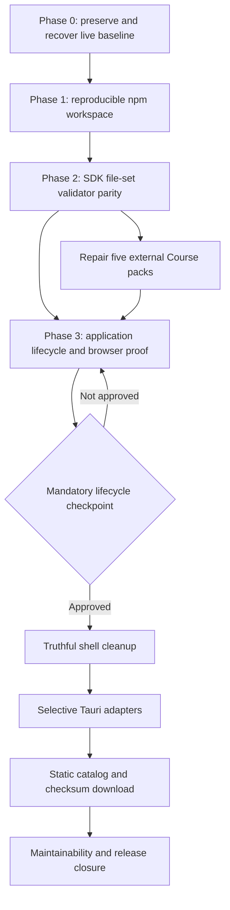

# Concourse Recovery and Delivery Implementation Plan

> **For agentic workers:** REQUIRED SUB-SKILL: Use `superpowers:subagent-driven-development` (recommended) or `superpowers:executing-plans` to implement this plan task-by-task. Steps use checkbox (`- [ ]`) syntax for tracking.

**Goal:** Recover the live Learnt worktree as the canonical Concourse npm workspace, then deliver a local-first pack lifecycle that is reproducible, validator-consistent, durable in browser and desktop shells, and ready for a checksum-verified static catalog.

**Architecture:** Keep the existing modular monolith: core contracts, engine, and subject SDK remain framework and platform independent; application owns installed-pack decisions and projections; browser and Tauri act only through adapters. The SDK receives complete pack file sets, validates documents and manifest hashes once, and produces a canonical candidate. The application lifecycle persists releases by `packId`, selects one active release, retains one rollback release, and reconstructs runtime adapters from canonical documents on bootstrap.

**Tech Stack:** npm 11 workspaces; TypeScript 6, React 19, Vite 8, Vitest 4, Zod/Ajv; `@learnt/learning-pack-contracts`; `@learnt/learning-pack-sdk` including its browser entry; browser IndexedDB/File System Access API; Tauri/Rust only after the browser lifecycle gate.

## Global Constraints

- Treat `C:\Projects\Learning\Learnt` as the canonical Concourse product tree. Keep the public package names `@learnt/learning-pack-contracts` and `@learnt/learning-pack-sdk` unchanged.
- Preserve the live worktree before any recovery commit. The observed baseline is 103 status entries: 48 tracked changes and 55 untracked files; physical untracked-line counts are about 23.9k, consistent with the supplied approximate count.
- Do not reset, clean, checkout, stash, revert, auto-format, stage, or otherwise alter unrelated existing work while carrying out the recovery steps.
- Do not modify `docs/design/**`, including generated HTML, JavaScript, thumbnails, uploads, or scratch artifacts. Add `docs/design/**` to formatter exclusions rather than rewriting it.
- Keep core contracts, engine, and subject SDK independent of React, browser APIs, Tauri, filesystem APIs, and infrastructure. UI reads the application facade; it never imports a browser or desktop adapter.
- Keep all learner progress, sessions, pack releases, and selected folders local. Do not add accounts, hosted learner state, payments, ratings, reviews, marketplace behavior, creator workflows, or cloud sync.
- A failed validation, download, adaptation, store write, or runtime-registration operation must leave the previously active valid release unchanged and report structured diagnostics to the caller.
- No implementation task may touch more than five files unless it is marked **mechanical package import** or **mechanical Course-pack manifest repair**. Do not mix such a mechanical change with behavioral code.
- Every behavioral task starts by adding its focused failing test, then implements the smallest code that makes that test pass.

---

## Verified Starting Point

| Area                 | Verified condition                                                                                                                                                                              | Planning consequence                                                                                               |
| -------------------- | ----------------------------------------------------------------------------------------------------------------------------------------------------------------------------------------------- | ------------------------------------------------------------------------------------------------------------------ |
| Canonical tree       | `Learnt` is on `codey/local-first-desktop-catalog`; it has both Concourse and Learnt remotes.                                                                                                   | Recover this tree; do not replace it with `Concourse-Desktop`.                                                     |
| Current quality gate | Root typecheck, lint, 254 tests, and build pass; Vite reports only its chunk-size warning. `format:check` fails on 11 files.                                                                    | Preserve this executable baseline and make format green without touching generated design files.                   |
| Reproducibility      | Root `package.json` uses `file:../learning-pack-contracts` and `file:../learning-pack-sdk`; neither sibling has `.git`.                                                                         | Copy the packages into the root workspace before making any further pack work depend on them.                      |
| Validation split     | Browser directory import reads only public JSON then calls `installLearningPackDocuments`; SDK directory validation reads every file and checks hashes.                                         | Browser and desktop must feed complete file records through the SDK browser/Node loaders.                          |
| Course fixtures      | All five `Courses` packs pass document-only validation but fail SDK validation. Four have undeclared `README.md`; `llm-from-scratch` additionally contains forbidden undeclared `generate.mjs`. | Add an integrity-tracked documentation role, declare the READMEs, and move the generator outside the release root. |
| Upgrade defect       | `installedPackKey()` is `packId + "\0" + packVersion`; runtime maps may contain both versions while lookup resolves only `packId`.                                                              | Persist one record per `packId` with an explicit active release and rollback reference.                            |
| Desktop donor        | `Concourse-Desktop` has 227 passing tests, but its Tauri scanner and pack-sync service use duplicate schemas, transient WebView path state, and no lifecycle.                                   | Reuse only adapter shapes and tests after the lifecycle gate; never bulk merge donor source.                       |

## Target Interfaces and Dependency Graph

The following contracts are introduced in the named tasks. They are intentionally owned outside `src/core/**` because installed releases and source selection are application concerns that depend on learning-pack contracts.

```ts
// src/application/installed-learning-pack-lifecycle.ts
export type ValidatedLearningPackCandidate = Readonly<{
  source: 'browser-directory' | 'desktop-folder' | 'catalog-download'
  sourceLabel: string
  contentHash: string
  documents: DeepReadonly<LearningPackDocuments>
  warnings: readonly LearningPackDiagnostic[]
}>

export type InstalledLearningPackRelease = Readonly<{
  releaseId: string // identical to contentHash
  packId: string
  packVersion: string
  installedAt: string
  source: ValidatedLearningPackCandidate['source']
  sourceLabel: string
  contentHash: string
  documents: DeepReadonly<LearningPackDocuments>
  warnings: readonly LearningPackDiagnostic[]
}>

export type InstalledLearningPackRecord = Readonly<{
  schemaVersion: '1'
  packId: string
  activeReleaseId: string
  rollbackReleaseId?: string
  releases: readonly InstalledLearningPackRelease[] // active plus at most one rollback
}>

export interface InstalledLearningPackStore {
  list(): Promise<readonly InstalledLearningPackRecord[]>
  write(record: InstalledLearningPackRecord): Promise<void>
}

export type InstalledPackChange =
  | Readonly<{ kind: 'install'; record: InstalledLearningPackRecord }>
  | Readonly<{ kind: 'reinstall'; record: InstalledLearningPackRecord }>
  | Readonly<{
      kind: 'upgrade'
      record: InstalledLearningPackRecord
      fromVersion: string
    }>
  | Readonly<{
      kind: 'reject'
      code: 'same-version-content-conflict' | 'downgrade-blocked'
    }>
```



### Concurrency Rules

1. Phase 0 has one recovery owner. Nobody formats, rebases, moves files, or starts package work until the preservation snapshot is verified.
2. In Phase 1, the contracts workspace copy precedes the SDK workspace copy; root scripts, CI, and clean-clone proof begin only when both copies build locally.
3. In Phase 2, the contract `documentation` role and SDK common loader have one owner each. The Course-pack repair worker starts only after the `documentation` role is exported and tested. Browser adapter work starts only after the browser file-loader API is exported.
4. In Phase 3, one owner changes lifecycle interfaces, composition, and `LearntApplication`. Browser source/state adapter work may proceed in parallel only against the frozen interfaces above. UI work begins after both land.
5. Do not begin any Tauri, catalog, or desktop packaging work before the checkpoint approves the browser lifecycle matrix. Do not copy donor application services, localStorage imported-pack stores, catalog fixtures, or dirty imported-route files.

## Phase 0 — Preservation and Canonical Recovery

### Task 0.1: Preserve the live baseline outside the repository

**Files:**

- Create outside the repository: `C:\Projects\Learning\_recovery\concourse-2026-07-10\tracked.patch`
- Create outside the repository: `C:\Projects\Learning\_recovery\concourse-2026-07-10\staged.patch`
- Create outside the repository: `C:\Projects\Learning\_recovery\concourse-2026-07-10\status-all.txt`
- Create outside the repository: `C:\Projects\Learning\_recovery\concourse-2026-07-10\status.txt`
- Create outside the repository: `C:\Projects\Learning\_recovery\concourse-2026-07-10\untracked-files.txt`
- Create outside the repository: `C:\Projects\Learning\_recovery\concourse-2026-07-10\untracked.tar`

**Dependencies:** None. This is the only task allowed to operate before a recovery commit exists.

- [ ] **Step 1: Capture the exact status and tracked diffs without changing the worktree.**

```powershell
$recovery = 'C:\Projects\Learning\_recovery\concourse-2026-07-10'
$planPath = 'docs/superpowers/plans/2026-07-10-concourse-recovery-and-delivery-plan.md'
New-Item -ItemType Directory -Force -Path $recovery | Out-Null
git status --porcelain=v1 -uall | Tee-Object -FilePath "$recovery\status-all.txt" |
  Where-Object { $_ -notmatch [regex]::Escape($planPath) } |
  Set-Content "$recovery\status.txt"
git diff --binary | Set-Content "$recovery\tracked.patch"
git diff --cached --binary | Set-Content "$recovery\staged.patch"
git ls-files --others --exclude-standard |
  Where-Object { $_ -ne $planPath } |
  Set-Content "$recovery\untracked-files.txt"
```

Expected: `status-all.txt` includes this roadmap file; `status.txt` records the preexisting 103 entries, including 55 untracked paths; `tracked.patch` and `staged.patch` are readable patch files.

- [ ] **Step 2: Archive all untracked paths with their relative paths intact.**

```powershell
$paths = Get-Content "$recovery\untracked-files.txt"
tar -cf "$recovery\untracked.tar" --files-from "$recovery\untracked-files.txt"
tar -tf "$recovery\untracked.tar" | Compare-Object -ReferenceObject $paths
```

Expected: `Compare-Object` emits no differences. If `tar` is unavailable, stop this task; do not substitute a flattening copy operation.

- [ ] **Step 3: Record baseline verification without formatting or mutation.**

```powershell
git diff --check
npm run typecheck
npm run lint
npm run test
npm run build
npm run format:check
```

Expected: the first four npm commands pass, and format reports exactly the known 11 files. No `prettier --write` command is run.

**Acceptance criteria:** The recovery archive is outside the repository, its untracked archive lists every untracked path, `git status --porcelain=v1 -uall` is unchanged after the task, and `docs/design/**` remains untouched.

**Commit boundary:** None. This task creates evidence only.

### Task 0.2: Establish the reviewable canonical recovery baseline

**Files:** Existing non-generated application, test, script, and authored documentation changes already present in the live worktree; explicitly exclude `docs/design/**`, `dist/**`, `test-results/**`, `.wrangler/**`, logs, and any recovery archive.

**Dependencies:** Task 0.1.

- [ ] **Step 1: Classify every dirty path against the preserved status file.**

```powershell
$status = Get-Content 'C:\Projects\Learning\_recovery\concourse-2026-07-10\status.txt'
$status | Where-Object { $_ -match 'docs/design/' }
$status | Where-Object { $_ -notmatch 'docs/design/' }
```

Expected: generated design artifacts are isolated from authored runtime, tests, and authored documentation.

- [ ] **Step 2: Review the existing pack/practice feature set before staging it.**

```powershell
git diff -- src/application src/learning-packs src/ui src/app src/core src/infrastructure
git status --short -- docs/learning-packs docs/practice
```

Expected: reviewers can identify the existing application behavior and its tests without treating the design artifacts as source of truth.

- [ ] **Step 3: Create a recovery commit only after the reviewer accepts the recovered authored baseline.**

```powershell
git add src scripts docs/learning-packs docs/practice package.json package-lock.json eslint.config.js index.html tsconfig.node.json
git restore --staged docs/design 2>$null
git commit -m "chore: recover canonical learning-pack baseline"
```

Expected: the commit contains the intended authored baseline and no `docs/design/**` path. Generated design changes stay preserved in Task 0.1's archive until a design-specific request authorizes them.

**Acceptance criteria:** Subsequent work begins from a committed, reviewable application baseline; no generated design artifact is staged; the preservation archive remains available.

**Commit boundary:** `chore: recover canonical learning-pack baseline`. This is a one-time preservation exception to the five-file guideline; it must contain no new behavior.

**Stop/go gate:** Stop if the snapshot differs from the live worktree, a generated design artifact is selected for staging, or the reviewer cannot classify a changed path. Go only after the recovery commit is accepted.

## Phase 1 — Workspace Reproducibility, Formatting, CI, and Clean Clone

### Task 1.1: Import the contracts package into the canonical workspace

**Files:** **Mechanical package import exception.**

- Create: `packages/learning-pack-contracts/{src/**,test/**,fixtures/**,scripts/**,docs/**,package.json,tsconfig.json,vitest.config.ts,README.md,AGENTS.md,CODING_STANDARDS.md,MEMORY.md,.gitignore}`

**Interfaces:** Preserve package name and public API exactly:

```json
{
  "name": "@learnt/learning-pack-contracts",
  "version": "0.1.0"
}
```

**Dependencies:** Task 0.2.

- [ ] **Step 1: Copy only source-controlled package material; exclude build and install outputs.**

```powershell
$from = 'C:\Projects\Learning\learning-pack-contracts'
$to = 'packages\learning-pack-contracts'
robocopy $from $to /E /XD node_modules dist /XF package-lock.json
if ($LASTEXITCODE -gt 7) { throw "robocopy failed with $LASTEXITCODE" }
```

Expected: the new package contains source, tests, fixtures, scripts, and package metadata, but not `node_modules`, `dist`, or the sibling package lockfile.

- [ ] **Step 2: Prove the copied contracts package in isolation before importing its consumer.**

```powershell
npm --prefix packages/learning-pack-contracts install --package-lock=false
npm --prefix packages/learning-pack-contracts run typecheck
npm --prefix packages/learning-pack-contracts run test
```

Expected: typecheck passes and the contracts suite reports 52 passing tests before new Phase 2 tests are added.

**Acceptance criteria:** The copied contracts package builds and tests from `packages/`, its public API and package name are unchanged, and the original sibling directory has not been modified.

**Commit boundary:** `chore: vendor learning-pack contracts workspace`.

### Task 1.2: Import the SDK package and remove sibling-path coupling

**Files:** **Mechanical package import exception.**

- Modify: `package.json`
- Modify: `package-lock.json`
- Modify: `src/learning-packs/learnt-importer.test.ts`
- Create: `packages/learning-pack-sdk/{src/**,test/**,package.json,tsconfig.json,vitest.config.ts,README.md,AGENTS.md,CODING_STANDARDS.md,MEMORY.md,.gitignore}`
- Modify: `packages/learning-pack-sdk/package.json`

**Interfaces:** Preserve both SDK entry points. The SDK depends on the copied contracts package through npm workspace resolution at the matching local version.

```jsonc
// package.json
{
  "name": "concourse",
  "private": true,
  "workspaces": [
    "packages/learning-pack-contracts",
    "packages/learning-pack-sdk",
  ],
  "dependencies": {
    "@learnt/learning-pack-contracts": "0.1.0",
    "@learnt/learning-pack-sdk": "0.1.0",
  },
}
```

```jsonc
// packages/learning-pack-sdk/package.json
{
  "dependencies": {
    "@learnt/learning-pack-contracts": "0.1.0",
  },
  "exports": {
    ".": { "types": "./dist/index.d.ts", "import": "./dist/index.js" },
    "./browser": {
      "types": "./dist/browser.d.ts",
      "import": "./dist/browser.js",
    },
  },
}
```

**Dependencies:** Task 1.1.

- [ ] **Step 1: Copy SDK source without its installed dependencies or built files.**

```powershell
$from = 'C:\Projects\Learning\learning-pack-sdk'
$to = 'packages\learning-pack-sdk'
robocopy $from $to /E /XD node_modules dist /XF package-lock.json
if ($LASTEXITCODE -gt 7) { throw "robocopy failed with $LASTEXITCODE" }
```

- [ ] **Step 2: Replace root and SDK sibling `file:` dependencies with matching workspace package version `0.1.0`, regenerate only the root lockfile, and resolve archive-test fixtures from `packages/learning-pack-contracts` rather than a parent sibling.**

```powershell
npm install --package-lock-only
rg -n 'file:\.\./learning-pack-(contracts|sdk)' package.json package-lock.json packages
```

Expected: the search returns no sibling package references; the root lockfile links both workspace packages.

- [ ] **Step 3: Build the package dependency chain and execute the SDK suite.**

```powershell
npm --workspace=@learnt/learning-pack-contracts run build
npm --workspace=@learnt/learning-pack-sdk run typecheck
npm --workspace=@learnt/learning-pack-sdk run test
```

Expected: SDK test reports 14 passing tests before Phase 2 adds parity coverage.

**Acceptance criteria:** A root install resolves contracts and SDK from `packages/`, the existing app continues to import the same package names, and both original sibling directories remain unchanged.

**Commit boundary:** `chore: vendor learning-pack sdk workspace`.

### Task 1.3: Make root verification deterministic, format only owned files, and add CI

**Files:**

- Modify: `package.json`
- Modify: `eslint.config.js`
- Modify: `.prettierignore`
- Create: `scripts/verify-clean-clone.ps1`
- Create: `.github/workflows/ci.yml`

**Interfaces:** Root scripts build the workspace package chain before any operation that resolves its declaration-only package entry points. This makes each quality command independently runnable after `npm ci`, rather than depending on a preceding command having left `dist/` in the worktree.

```json
{
  "scripts": {
    "typecheck:packages": "npm run build:packages && npm --workspace=@learnt/learning-pack-contracts run typecheck && npm --workspace=@learnt/learning-pack-sdk run typecheck",
    "test:packages": "npm run build:packages && npm --workspace=@learnt/learning-pack-contracts run test && npm --workspace=@learnt/learning-pack-sdk run test",
    "build:packages": "npm --workspace=@learnt/learning-pack-contracts run build && npm --workspace=@learnt/learning-pack-sdk run build",
    "typecheck": "npm run typecheck:packages && tsc -b",
    "lint": "npm run build:packages && eslint .",
    "test": "npm run test:packages && vitest run src",
    "build": "npm run build:packages && tsc -b && vite build"
  }
}
```

**Dependencies:** Tasks 1.1 and 1.2.

- [ ] **Step 1: Write the clean-clone gate before changing root scripts.**

```powershell
param([string]$Repository = (Get-Location).Path)
$clone = Join-Path $env:TEMP ("concourse-clean-" + [guid]::NewGuid())
git clone --no-local $Repository $clone
Push-Location $clone
try {
  npm ci
  npm run format:check
  npm run typecheck
  npm run lint
  npm run test
  npm run build
  if (rg -n 'file:\.\./learning-pack-(contracts|sdk)' package.json package-lock.json packages) { exit 1 }
} finally { Pop-Location }
```

Expected before implementation: the script fails because the workspace and scripts do not exist.

- [ ] **Step 2: Apply the deterministic scripts and scope root linting correctly.**

Add `packages/**` to `globalIgnores` in `eslint.config.js`; package typecheck and test commands remain the package quality gate. Do not make the root TypeScript project parse package files through app tsconfigs.

- [ ] **Step 3: Apply the formatting policy.**

Add `docs/design/**` and `packages/**` to `.prettierignore`. Keep imported package fixtures and reference documents byte-stable; run dedicated format commands from each package workspace for their `src`, `test`, package script, and Vitest configuration files. Set Prettier `endOfLine` to `auto` so the local Windows clean-clone gate does not report the entire repository solely because Git materializes CRLF. Format the eight owned non-generated failures: `docs/learning-packs/learnt-importer-handoff.md`, `src/application/practice-runtime.ts`, `src/ui/app/App.product-flow.test.tsx`, `src/ui/screens/LearningResourceScreen.test.ts`, `src/ui/screens/ProfileScreen.tsx`, `src/ui/screens/ProgressScreen.tsx`, `src/ui/screens/SubjectLibraryScreen.tsx`, and `src/ui/styles/global.css`; also format the plan and importer test changed by this recovery. Perform any formatting of imported package source as a separate mechanical commit.

```powershell
npx prettier --write docs/learning-packs/learnt-importer-handoff.md src/application/practice-runtime.ts src/ui/app/App.product-flow.test.tsx src/ui/screens/LearningResourceScreen.test.ts src/ui/screens/ProfileScreen.tsx src/ui/screens/ProgressScreen.tsx src/ui/screens/SubjectLibraryScreen.tsx src/ui/styles/global.css
npm --workspace=@learnt/learning-pack-contracts exec -- prettier --write src test scripts/generate-logic-foundations-fixture.mjs vitest.config.ts
npm --workspace=@learnt/learning-pack-sdk exec -- prettier --write src test vitest.config.ts
npm run format:check
```

Expected: format check passes and no path under `docs/design/**` is changed.

- [ ] **Step 4: Add CI and run the clean-clone proof.**

`ci.yml` uses Node 24, `npm ci`, then `npm run format:check`, `npm run typecheck`, `npm run lint`, `npm run test`, and `npm run build`.

```powershell
powershell -ExecutionPolicy Bypass -File scripts/verify-clean-clone.ps1
```

Expected: a clone that has no sibling directories available installs and passes all five gates. The test total is at least the recovered 254 app tests plus 52 contracts and 14 SDK tests, plus the new workspace checks.

**Acceptance criteria:** Root format, typecheck, lint, test, and build pass; CI executes the same commands; a clean clone has no unresolved external package dependency; original sibling directories remain untouched.

**Commit boundaries:** `chore: make Concourse workspace verification reproducible`; then `style: format recovered owned sources` and `style: format imported package sources` as distinct commits.

**Stop/go gate:** Stop if clean-clone verification reads either sibling package, if `docs/design/**` appears in the formatter diff, or if package tests cannot run from the workspace. Go to Phase 2 only after local and CI-equivalent clean-clone gates pass.

## Phase 2 — Validator Parity and Course-Pack Repair

### Task 2.1: Make README files first-class, integrity-tracked pack documentation

**Files:**

- Modify: `packages/learning-pack-contracts/src/types.ts`
- Modify: `packages/learning-pack-contracts/src/schemas.ts`
- Modify: `packages/learning-pack-contracts/src/semantic-validation.ts`
- Modify: `packages/learning-pack-contracts/test/learning-pack-contracts.test.ts`
- Modify: `docs/learning-packs/agent-course-authoring-guide.md`

**Interfaces:**

```ts
export type PackFileRole =
  | 'catalog'
  | 'courses'
  | 'items'
  | 'sets'
  | 'resources'
  | 'theme'
  | 'migrations'
  | 'asset'
  | 'documentation'

// A README declaration has assetId: null, path: 'README.md',
// role: 'documentation', and mediaType: 'text/markdown'.
```

**Dependencies:** Phase 1 clean-clone gate.

- [ ] **Step 1: Add failing contract tests for a declared and undeclared README.**

```ts
expect(validatedManifest.files).toContainEqual(
  expect.objectContaining({
    path: 'README.md',
    role: 'documentation',
    mediaType: 'text/markdown',
    assetId: null,
  }),
)
expect(validationForUndeclaredReadme.ok).toBe(false)
```

Expected: the declared README test fails because the role is not currently allowed.

- [ ] **Step 2: Add `documentation` to the TypeScript union and JSON schema, then require its exact role/path/media-type pairing in semantic validation.**

Reject `documentation` entries when `assetId` is not `null`, `path` is not exactly `README.md`, or `mediaType` is not `text/markdown`. This keeps full-directory validation strict without admitting arbitrary ancillary files.

- [ ] **Step 3: Update authoring rules and verify contracts.**

```powershell
npm --workspace=@learnt/learning-pack-contracts run test
npm --workspace=@learnt/learning-pack-contracts run build
```

Expected: all prior contract tests and the new documentation tests pass.

**Acceptance criteria:** The authoring guide and contract agree that every pack README is manifest-declared and hash-tracked; an undeclared README remains a blocking diagnostic.

**Commit boundary:** `feat: validate pack README documentation`.

### Task 2.2: Consolidate SDK file-set validation and export the browser loader

**Files:**

- Create: `packages/learning-pack-sdk/src/documents-common.ts`
- Modify: `packages/learning-pack-sdk/src/documents.ts`
- Modify: `packages/learning-pack-sdk/src/documents-browser.ts`
- Modify: `packages/learning-pack-sdk/src/browser.ts`
- Modify: `packages/learning-pack-sdk/test/browser-entry.test.ts`

**Interfaces:** Node and browser compute their platform-specific hashes, then use the same common parser, document validator, path validator, manifest hash verifier, and `LoadedLearningPack` construction.

```ts
// packages/learning-pack-sdk/src/browser.ts
export { loadLearningPackFromFilesAsync } from './documents-browser.js'

export async function loadLearningPackFromFilesAsync(
  sourceKind: LoadedLearningPack['sourceKind'],
  sourcePath: string,
  inputFiles: readonly PackFileRecord[],
  options?: LearningPackSdkOptions,
): Promise<LoadedLearningPack | { diagnostics: LearningPackDiagnostic[] }>
```

**Dependencies:** Task 2.1.

- [ ] **Step 1: Add a parity fixture that includes `README.md`, a valid manifest hash, and an invalid manifest hash.**

```ts
const nodeResult = loadLearningPackFromFiles('directory', 'fixture', files)
const browserResult = await loadLearningPackFromFilesAsync(
  'directory',
  'fixture',
  files,
)
expect(diagnosticSummary(browserResult)).toEqual(diagnosticSummary(nodeResult))
```

Expected: the test fails because browser and Node currently duplicate validation paths and the browser function is not public.

- [ ] **Step 2: Extract the shared validation after normalized file records are available.**

`documents-common.ts` owns parsing all `PUBLIC_JSON_FILE_PATHS`, full manifest-file verification, duplicate-path diagnostics, and `contentHash` inputs. `documents.ts` keeps synchronous Node hashing; `documents-browser.ts` keeps asynchronous Web Crypto hashing. Neither code path gets a browser-only exception for README files.

- [ ] **Step 3: Export the async browser file loader and execute focused suites.**

```powershell
npm --workspace=@learnt/learning-pack-sdk run test
npm --workspace=@learnt/learning-pack-contracts run test
```

Expected: SDK tests include browser/Node diagnostic parity and retain every prior passing case.

**Acceptance criteria:** The browser entry can validate an arbitrary complete `PackFileRecord[]`; Node directory and browser file-set validation report identical diagnostics for the same bytes; archive validation continues through the same common path.

**Commit boundary:** `refactor: share learning-pack file validation`.

### Task 2.3: Replace browser document-only import with complete SDK file-set validation

**Files:**

- Modify: `src/ui/app/browser-learning-pack-directory-import.ts`
- Modify: `src/ui/app/browser-learning-pack-directory-import.test.ts`
- Modify: `src/learning-packs/learnt-importer.test.ts`
- Modify: `src/ui/app/LearningPackLibrary.product.test.tsx`

**Interfaces:** The browser source reader returns every file recursively as a path and byte payload, then calls `@learnt/learning-pack-sdk/browser`.

```ts
type BrowserReadableFile = Readonly<{
  arrayBuffer: () => Promise<ArrayBuffer>
}>

const loaded = await loadLearningPackFromFilesAsync(
  'directory',
  directory.name,
  files.map(({ path, bytes }) => ({ path, bytes })),
)
```

**Dependencies:** Task 2.2.

- [ ] **Step 1: Write a failing browser importer test for a hash-mismatched declared README.**

```ts
expect(outcome.status).toBe('invalid')
expect(outcome.diagnostics).toContainEqual(
  expect.objectContaining({ path: 'pack.json.files.README.md.sha256' }),
)
```

- [ ] **Step 2: Enumerate the selected directory recursively, reject a duplicate relative path, and pass every normalized file record to the exported browser SDK loader.**

Only a successful `LoadedLearningPack` may be adapted with `installLearningPackDocuments` during this phase. Invalid candidates retain the SDK diagnostic array and never enter runtime registration.

- [ ] **Step 3: Prove browser/SDK parity from the product boundary.**

```powershell
npm run test -- src/ui/app/browser-learning-pack-directory-import.test.ts src/learning-packs/learnt-importer.test.ts src/ui/app/LearningPackLibrary.product.test.tsx
```

Expected: directory selection reports all valid candidates, reports the same manifest failure as SDK validation, and does not register invalid candidates.

**Acceptance criteria:** Browser imports no longer bypass hashes, README declarations, optional-file handling, or capability diagnostics.

**Commit boundary:** `fix: validate browser pack imports through sdk`.

### Task 2.4: Repair README manifests for four Course packs

**Files:** **Mechanical Course-pack manifest repair.**

- Modify: `C:\Projects\Learning\Courses\ai-foundations\pack.json`
- Modify: `C:\Projects\Learning\Courses\GROK-AI\pack.json`
- Modify: `C:\Projects\Learning\Courses\linear-algebra\pack.json`
- Modify: `C:\Projects\Learning\Courses\logic\pack.json`

**Dependencies:** Tasks 2.1 and 2.2.

- [ ] **Step 1: Compute each existing README's UTF-8 byte count and SHA-256.**

```powershell
$packs = 'ai-foundations','GROK-AI','linear-algebra','logic'
foreach ($pack in $packs) {
  $readme = "C:\Projects\Learning\Courses\$pack\README.md"
  $bytes = [System.IO.File]::ReadAllBytes($readme)
  [pscustomobject]@{ Pack = $pack; Bytes = $bytes.Length; Sha256 = (Get-FileHash $readme -Algorithm SHA256).Hash.ToLowerInvariant() }
}
```

- [ ] **Step 2: Generate each exact manifest entry from the measured file rather than typing a hash.**

```powershell
foreach ($pack in $packs) {
  $readme = "C:\Projects\Learning\Courses\$pack\README.md"
  $bytes = [System.IO.File]::ReadAllBytes($readme)
  [ordered]@{
    assetId = $null
    path = 'README.md'
    role = 'documentation'
    mediaType = 'text/markdown'
    sha256 = (Get-FileHash $readme -Algorithm SHA256).Hash.ToLowerInvariant()
    bytes = $bytes.Length
  } | ConvertTo-Json
}
```

Insert the emitted object into each matching `pack.json` and preserve the manifest's existing sorted path order.

- [ ] **Step 3: Validate all four full directories with the SDK CLI.**

```powershell
npm --workspace=@learnt/learning-pack-sdk run build
$packs | ForEach-Object { node packages/learning-pack-sdk/dist/cli.js validate "C:\Projects\Learning\Courses\$_" }
```

Expected: each command exits zero; optional-capability messages remain warnings rather than errors.

**Acceptance criteria:** These four packs pass SDK directory validation using their complete directory contents, not a JSON-only surrogate.

**Commit boundary:** Commit the four manifest changes together only in the repository that owns `Courses`; do not mix them with application code.

### Task 2.5: Move the LLM generator outside the release root and validate it honestly

**Files:**

- Move: `C:\Projects\Learning\Courses\llm-from-scratch\generate.mjs` to `C:\Projects\Learning\Courses\tools\llm-from-scratch-generate.mjs`
- Modify: `C:\Projects\Learning\Courses\llm-from-scratch\pack.json`
- Modify: `C:\Projects\Learning\Courses\llm-from-scratch\README.md`
- Modify: `C:\Projects\Learning\Courses\tools\llm-from-scratch-generate.mjs`

**Dependencies:** Tasks 2.1 and 2.2.

- [ ] **Step 1: Write the failing full-directory validation command before moving the generator.**

```powershell
node packages/learning-pack-sdk/dist/cli.js validate C:\Projects\Learning\Courses\llm-from-scratch
```

Expected: blocking diagnostics identify undeclared `README.md` and forbidden, undeclared `generate.mjs`.

- [ ] **Step 2: Move authoring code out of the release directory.**

The moved script sets its output root to `../llm-from-scratch/` relative to `Courses/tools/`, retains its original authored data, and changes its self-check from document-only `validateLearningPackDocuments` to the SDK full-file loader. It must generate the README documentation manifest entry from the exact UTF-8 README bytes.

- [ ] **Step 3: Update the pack README and manifest, then regenerate and validate.**

```powershell
node C:\Projects\Learning\Courses\tools\llm-from-scratch-generate.mjs
node packages/learning-pack-sdk/dist/cli.js validate C:\Projects\Learning\Courses\llm-from-scratch
```

Expected: the pack root contains no executable generator; README is a declared `documentation` file; validation exits zero.

**Acceptance criteria:** Every one of the five Courses packs validates through the SDK, browser/SDK parity tests pass, and no executable source appears in a distributable pack directory.

**Commit boundary:** Commit the LLM content-tool move and generated pack manifest as one content-only commit in the repository that owns `Courses`.

**Stop/go gate:** Stop if any Course pack still needs document-only validation to pass, if browser and Node diagnostics differ for the same file set, or if an executable file remains in a pack root. Go to Phase 3 only when the five SDK CLI commands pass and all root verification remains green.

## Phase 3 — Durable Installed-Pack Lifecycle and Browser Vertical Slice

### Task 3.1: Define and test the application-owned release lifecycle

**Files:**

- Create: `src/application/installed-learning-pack-lifecycle.ts`
- Create: `src/application/installed-learning-pack-lifecycle.test.ts`
- Modify: `src/application/learnt-application.types.ts`
- Modify: `src/application/index.ts`

**Dependencies:** Phase 2 stop/go gate.

- [ ] **Step 1: Add failing lifecycle tests for all four required decisions.**

```ts
expect(
  planInstalledPackChange({ existing: null, candidate: v1 }),
).toMatchObject({ kind: 'install' })
expect(
  planInstalledPackChange({ existing: v1Record, candidate: v1 }),
).toMatchObject({ kind: 'reinstall' })
expect(
  planInstalledPackChange({ existing: v1Record, candidate: v2 }),
).toMatchObject({ kind: 'upgrade', fromVersion: '1.0.0' })
expect(
  planInstalledPackChange({ existing: v1Record, candidate: invalidV2 }),
).toMatchObject({ kind: 'reject' })
```

Expected: no lifecycle module exists and the tests fail at import time.

- [ ] **Step 2: Implement deterministic release decisions.**

`install` creates one active release. `reinstall` is only legal when `packId`, version, and `contentHash` all match; it does not add another release. `upgrade` requires a strictly greater semver version, replaces `activeReleaseId`, retains the prior active release, and sets `rollbackReleaseId`. A different hash at the same version returns `same-version-content-conflict`; a lower version returns `downgrade-blocked`; neither writes a record. A failed SDK validation never produces a candidate and therefore cannot invoke `write`.

- [ ] **Step 3: Run focused tests.**

```powershell
npm run test -- src/application/installed-learning-pack-lifecycle.test.ts
```

Expected: install, same-version reinstall, v1-to-v2 upgrade, invalid update preservation, and record reconstruction decision tests pass.

**Acceptance criteria:** Records are keyed only by `packId`, contain a named active release plus rollback metadata, retain at most active and rollback canonical document sets, and never replace a valid active release on rejection.

**Commit boundary:** `feat: add installed pack release lifecycle`.

### Task 3.2: Implement browser-backed installed-release and selected-directory stores

**Files:**

- Modify: `package.json`
- Modify: `package-lock.json`
- Create: `src/infrastructure/learning-packs/browser-learning-pack-state-store.ts`
- Create: `src/infrastructure/learning-packs/browser-learning-pack-state-store.test.ts`
- Modify: `src/infrastructure/index.ts`

**Interfaces:**

```ts
export class BrowserLearningPackStateStore implements InstalledLearningPackStore {
  list(): Promise<readonly InstalledLearningPackRecord[]>
  write(record: InstalledLearningPackRecord): Promise<void>
}

export interface BrowserLearningPackSourceStore {
  loadSelectedDirectory(): Promise<BrowserLearningPackSourceDirectoryHandle | null>
  saveSelectedDirectory(
    handle: BrowserLearningPackSourceDirectoryHandle,
  ): Promise<void>
  clearSelectedDirectory(): Promise<void>
}
```

**Dependencies:** Task 3.1.

- [ ] **Step 1: Add failing persistence tests using an injected IndexedDB implementation.**

```ts
await store.write(v1Record)
await store.write(v2Record)
expect((await store.list())[0]).toEqual(v2Record)
await directoryStore.saveSelectedDirectory(directoryHandle)
expect((await directoryStore.loadSelectedDirectory())?.name).toBe(
  directoryHandle.name,
)
```

Expected: the state-store module does not exist.

- [ ] **Step 2: Add `fake-indexeddb` as a test-only dependency and implement two object stores.**

Use IndexedDB database `concourse-learning-packs-v1`, object store `installed-pack-records` keyed by `packId`, and object store `preferences` keyed by `selected-directory`. Store the actual File System Access directory handle by structured clone; do not serialize it into localStorage. On an IndexedDB transaction failure, reject the operation before application runtime registration occurs.

- [ ] **Step 3: Prove record and selected-handle round trips.**

```powershell
npm run test -- src/infrastructure/learning-packs/browser-learning-pack-state-store.test.ts
```

Expected: records survive a fresh store instance, the selected handle is returned, and corrupt stored records are reported to the application as an invalid persisted record rather than deleted.

**Acceptance criteria:** Browser release documents and selected directory state survive a full page reload; no browser adapter writes pack content into learner session storage.

**Commit boundary:** `feat: persist browser pack releases and selected directory`.

### Task 3.3: Rehydrate active releases and make facade installation transactional

**Files:**

- Modify: `src/application/learnt-application.ts`
- Modify: `src/application/learnt-application.types.ts`
- Modify: `src/app/composition-root.ts`
- Modify: `src/main.tsx`
- Modify: `src/application/learnt-application.test.ts`

**Interfaces:**

```ts
async restoreInstalledLearningPacks(
  store: InstalledLearningPackStore,
): Promise<Readonly<{
  installed: readonly InstalledLearningPack[]
  states: readonly LearningPackLibraryStateEntry[]
}>>

async installValidatedLearningPack(
  candidate: ValidatedLearningPackCandidate,
): Promise<InstalledPackChange>
```

**Dependencies:** Tasks 3.1 and 3.2.

- [ ] **Step 1: Write the failing reload test before changing bootstrap.**

```ts
const first = await createApplicationWithStore(store)
await first.installValidatedLearningPack(v1)
const reloaded = await createApplicationWithStore(store)
expect(reloaded.getLearningPackLibrary().packs).toEqual(
  expect.arrayContaining([
    expect.objectContaining({
      packId: v1.documents.manifest.packId,
      packVersion: '1.0.0',
    }),
  ]),
)
```

- [ ] **Step 2: Reconstruct runtime adapters only from persisted active canonical documents.**

Call `installLearningPackDocuments(record.active.documents)` during restore; valid records register their adapters through the existing registry seam. A corrupt or no-longer-adaptable record produces a `LearningPackLibraryStateEntry` with state `invalid-pack` and remains stored for diagnostics. It does not block valid records or app bootstrap.

- [ ] **Step 3: Make installation ordered and reversible.**

Validate and adapt the candidate, calculate the lifecycle change, check subject-ID conflicts, write the next record, then replace runtime adapters. If runtime replacement fails, write the prior record back and restore its adapters. If store write fails, do not unregister the active adapter. Remove the old `packId + packVersion` ownership map and use one runtime owner per `packId`.

- [ ] **Step 4: Await browser bootstrap.**

`createBrowserLearntApplication()` becomes `async`; `src/main.tsx` awaits it before rendering the provider and continues to render `BootstrapFailure` for rejected bootstrap promises.

```powershell
npm run test -- src/application/learnt-application.test.ts src/app/composition-root.test.ts
npm run typecheck
```

Expected: reload reconstructs v1; v2 replaces v1 as active; a rejected candidate leaves v1 registered and stored.

**Acceptance criteria:** No runtime map is keyed by `packId + version`; restart reconstruction comes from the active persisted release; invalid updates and failed writes preserve the prior active version.

**Commit boundary:** `feat: rehydrate and transact installed pack releases`.

### Task 3.4: Move browser source handling behind a port and prove the complete user flow

**Files:**

- Move: `src/ui/app/browser-learning-pack-directory-import.ts` to `src/infrastructure/learning-packs/browser-learning-pack-source.ts`
- Modify: `src/ui/app/browser-learning-pack-directory-import.test.ts`
- Modify: `src/ui/app/learnt-application-client.ts`
- Modify: `src/ui/hooks/use-subject-library.ts`
- Modify: `src/ui/app/LearningPackLibrary.product.test.tsx`

**Interfaces:**

```ts
export interface LearningPackSourcePort {
  chooseDirectory(): Promise<readonly ValidatedLearningPackCandidate[] | null>
  readSelectedDirectory(): Promise<readonly ValidatedLearningPackCandidate[] | null>
}

// LearntApplication facade
chooseAndInstallLearningPackDirectory(): Promise<readonly InstalledPackChange[]>
syncSelectedLearningPackDirectory(): Promise<readonly InstalledPackChange[]>
```

**Dependencies:** Tasks 2.3 and 3.3.

- [ ] **Step 1: Add a failing product flow for import, navigation, and a new application instance.**

```ts
await user.click(screen.getByRole('button', { name: /choose pack directory/i }))
await user.click(screen.getByRole('link', { name: /open route/i }))
expect(await screen.findByText(/Logic Foundations/)).toBeVisible()
renderWithFreshApplicationUsingSamePackStore()
expect(await screen.findByText(/Logic Foundations/)).toBeVisible()
```

Expected: the fresh application instance has no imported packs before persistence and rehydration are wired.

- [ ] **Step 2: Keep browser API use inside the infrastructure source adapter.**

The adapter calls `showDirectoryPicker({ mode: 'read' })`, persists a selected handle through `BrowserLearningPackSourceStore`, recursively builds complete SDK file records, and returns only successful `ValidatedLearningPackCandidate` values plus structured rejected-candidate diagnostics. UI calls facade methods and never imports File System Access, IndexedDB, or SDK browser functions.

- [ ] **Step 3: Wire facade outcomes into the library hook.**

Await installation, refresh library data only after completed lifecycle results, and preserve per-candidate warning/error diagnostics. A cancelled picker returns an empty result; a missing permission requires selecting the folder again and never removes an active release.

- [ ] **Step 4: Execute the vertical-slice proof.**

```powershell
npm run test -- src/ui/app/browser-learning-pack-directory-import.test.ts src/ui/app/LearningPackLibrary.product.test.tsx src/application/learnt-application.test.ts
npm run typecheck
npm run lint
npm run build
```

Expected: all required install/reload tests pass; browser pack content and selected directory survive a new application instance; active v1 remains after invalid v2; the browser and SDK emit parity diagnostics.

**Acceptance criteria:** The browser user flow is `choose directory -> validate every file through SDK -> lifecycle install -> open Route/Loop -> reload -> reopen the same installed pack`; same-version reinstall is idempotent; v1-to-v2 has one active v2 release plus v1 rollback; invalid v2 preserves v1.

**Commit boundary:** `feat: persist browser pack import lifecycle`.

## Mandatory Checkpoint Before Desktop Work

Do not create `src-tauri`, install a Tauri dependency, copy donor code, or add a catalog download until a reviewer approves this checklist:

- [ ] The recovered root passes `npm run format:check`, `npm run typecheck`, `npm run lint`, `npm run test`, and `npm run build`.
- [ ] `scripts/verify-clean-clone.ps1` passes with no original sibling package directories present.
- [ ] Contracts and SDK workspace suites pass, including browser/Node file-set diagnostic parity.
- [ ] `ai-foundations`, `GROK-AI`, `linear-algebra`, `llm-from-scratch`, and `logic` each pass SDK directory validation.
- [ ] Product tests prove import -> navigate -> reload, same-version reinstall, v1 -> v2 active upgrade, and invalid v2 preservation of active v1.
- [ ] The source-port and lifecycle interfaces have been reviewed for browser and desktop use.

**Stop condition:** Any failed item returns work to its owning Phase 1–3 task. Desktop work has no waiver path.

## Phase 4 — Truthful Shell Cleanup After the Checkpoint

### Task 4.1: Remove fake offline and sync claims

**Files:**

- Modify: `src/ui/app/App.tsx`
- Modify: `src/ui/components/AppShell.tsx`
- Modify: `src/ui/screens/SettingsScreen.tsx`
- Modify: `src/ui/app/App.product-flow.test.tsx`

**Dependencies:** Mandatory checkpoint approval.

- [ ] **Step 1: Replace the failing fake-offline assertion with a local-first truth assertion.**

```ts
expect(
  screen.queryByRole('switch', { name: /offline mode/i }),
).not.toBeInTheDocument()
expect(
  screen.getByText(
    /installed packs and learning progress stay on this device/i,
  ),
).toBeVisible()
```

- [ ] **Step 2: Remove React-only offline toggles and claims that downloaded content or evidence syncs on reconnect.**

The shell may state that local content works without the catalog after installation; it must not describe a sync service that does not exist.

- [ ] **Step 3: Verify.**

```powershell
npm run test -- src/ui/app/App.product-flow.test.tsx
npm run lint
```

**Acceptance criteria:** No product copy claims cloud sync, reconnect synchronization, or desktop completion before that behavior exists.

**Commit boundary:** `fix: make local-first shell claims truthful`.

### Task 4.2: Make Transfer labels match the durable browser implementation

**Files:**

- Modify: `src/ui/screens/SubjectLibraryScreen.tsx`
- Modify: `src/ui/vocabulary/product-vocabulary-copy.ts`
- Modify: `src/ui/app/LearningPackLibrary.product.test.tsx`

**Dependencies:** Task 4.1.

- [ ] **Step 1: Add failing copy and state assertions.**

```ts
expect(
  screen.getByRole('button', { name: /choose pack directory/i }),
).toBeVisible()
expect(
  screen.getByRole('button', { name: /sync selected directory/i }),
).toBeEnabled()
expect(
  screen.queryByText('C:\\Projects\\Learning\\Courses'),
).not.toBeInTheDocument()
```

- [ ] **Step 2: Remove the hard-coded local path and transient-install wording.**

Use `Choose pack directory`, `Sync selected directory`, and `Installed locally` only when the lifecycle has committed the active release. Show a permission-reselection action when the restored handle cannot be read.

- [ ] **Step 3: Verify.**

```powershell
npm run test -- src/ui/app/LearningPackLibrary.product.test.tsx
```

**Acceptance criteria:** Transfer describes local browser capability accurately without implying a native filesystem shell or hosted service.

**Commit boundary:** `fix: align Transfer copy with durable local packs`.

## Phase 5 — Selective Tauri Filesystem Port

### Task 5.1: Add an isolated desktop shell and safe native course-folder adapter

**Files:**

- Create: `src-tauri/Cargo.toml`
- Create: `src-tauri/build.rs`
- Create: `src-tauri/src/main.rs`
- Create: `src-tauri/src/lib.rs`
- Create: `src/infrastructure/desktop/tauri-learning-pack-source.ts`

**Dependencies:** Mandatory checkpoint approval and Phase 4 completion.

**Donor references only:** `C:\Projects\Learning\Concourse-Desktop\src-tauri\src\lib.rs` and `src/infrastructure/desktop/tauri-pack-sync-client.ts`. Do not copy `pack-sync-service.ts`, localStorage imported-pack stores, donor catalog fixtures, `csp: null`, or dirty imported-route code.

- [ ] **Step 1: Add Rust tests before the scanner command.**

Create explicit Rust tests named `scan_valid_child_directory_returns_all_files_in_sorted_order`, `scan_partial_child_directory_returns_structured_diagnostic`, `scan_unreadable_root_returns_error`, and `scan_rejects_candidate_resolved_outside_selected_root`.

The test fixture covers a valid child pack, a partial child pack, an unreadable root, deterministic ordering, and a symlink or traversal attempt that resolves outside the selected root.

- [ ] **Step 2: Implement a narrow native command.**

`read_course_folder_candidates(selected_root)` canonicalizes the user-selected root, scans the root plus immediate child directories, and returns complete relative file byte payloads. It does not parse JSON, validate Zod schemas, choose an active release, write pack releases, download files, or touch learner progress.

- [ ] **Step 3: Implement the TypeScript adapter against `LearningPackSourcePort`.**

Map malformed invoke data and native errors into structured source diagnostics. Pass raw complete file records through the existing SDK browser-compatible validation path and application lifecycle. Persist the selected root in Tauri application configuration, not WebView localStorage.

- [ ] **Step 4: Verify native and TypeScript seams.**

```powershell
cargo test --manifest-path src-tauri/Cargo.toml
npm run test -- src/infrastructure/desktop/tauri-learning-pack-source.test.ts
npm run typecheck
```

Expected: valid packs reach the shared lifecycle; malformed responses, unreadable roots, and out-of-root candidates become diagnostics with no active-release mutation.

**Acceptance criteria:** Tauri is confined to `src-tauri/**` and `src/infrastructure/desktop/**`; application, core, SDK, and UI remain Tauri-free.

**Commit boundary:** `feat: add Tauri course-folder source adapter`.

### Task 5.2: Add desktop composition and executable smoke proof

**Files:**

- Modify: `package.json`
- Modify: `vite.config.ts`
- Create: `src/app/desktop-composition-root.ts`
- Create: `src/app/desktop-composition-root.test.ts`
- Create: `src/infrastructure/desktop/tauri-learning-pack-source.test.ts`

**Dependencies:** Task 5.1.

- [ ] **Step 1: Add a failing desktop-composition test using a fake `LearningPackSourcePort`.**

```ts
const app = await createDesktopLearntApplication({
  sourcePort,
  installedPackStore,
})
await app.syncSelectedLearningPackDirectory()
expect(app.getLearningPackLibrary().packs).toHaveLength(1)
```

- [ ] **Step 2: Add desktop scripts and compose the same application facade.**

The desktop composition supplies the Tauri source adapter and a filesystem-backed installed-pack store while retaining the same `LearntApplication` and lifecycle used by the browser.

- [ ] **Step 3: Run the executable smoke test.**

```powershell
npm run desktop:build
# Manual smoke: launch -> choose Courses folder -> sync valid pack -> open Route -> quit -> relaunch -> confirm the Route remains available.
```

Expected: packaged desktop launch succeeds; relaunch discovers the persisted active release without a network connection.

**Acceptance criteria:** The desktop is an adapter composition, not a fork. The complete shared lifecycle matrix passes for filesystem candidates.

**Commit boundary:** `feat: compose Concourse desktop shell`.

## Phase 6 — Official Static Catalog and Checksum-Verified Download

### Task 6.1: Define a static catalog contract and application ports

**Files:**

- Create: `packages/learning-pack-contracts/src/catalog-index.ts`
- Modify: `packages/learning-pack-contracts/src/index.ts`
- Modify: `packages/learning-pack-contracts/src/types.ts`
- Create: `packages/learning-pack-contracts/test/catalog-index.test.ts`
- Create: `src/application/pack-catalog.ts`

**Interfaces:**

```ts
export type OfficialPackCatalogEntry = Readonly<{
  packId: string
  version: string
  title: string
  summary: string
  publisher: string
  license: string
  tags: readonly string[]
  compatibility: Readonly<{ minAppVersion: string; packSchemaVersion: '0.1' }>
  download: Readonly<{ url: string; sha256: string }>
}>

export interface PackCatalogClient {
  loadCatalog(): Promise<readonly OfficialPackCatalogEntry[]>
}

export interface PackDownloader {
  downloadVerified(
    entry: OfficialPackCatalogEntry,
  ): Promise<ValidatedLearningPackCandidate>
}
```

**Dependencies:** Phase 5 desktop smoke proof.

- [ ] **Step 1: Add failing schema tests for a valid SHA-256, invalid checksum, and incompatible pack schema version.**
- [ ] **Step 2: Implement the parser and compatibility filter.** The catalog remains discovery metadata; it contains no learner state and catalog unavailability cannot prevent opening installed releases.
- [ ] **Step 3: Verify.**

```powershell
npm --workspace=@learnt/learning-pack-contracts run test
npm run test -- src/application/pack-catalog.test.ts
```

**Acceptance criteria:** Only validated, app-compatible static entries reach UI read models; no donor `.test` download URL or dummy checksum is copied.

**Commit boundary:** `feat: define static pack catalog contract`.

### Task 6.2: Download, verify, stage, and install through the existing lifecycle

**Files:**

- Create: `src/infrastructure/catalog/http-pack-catalog-client.ts`
- Create: `src/infrastructure/catalog/verified-pack-downloader.ts`
- Create: `src/infrastructure/catalog/verified-pack-downloader.test.ts`
- Modify: `src/app/desktop-composition-root.ts`
- Modify: `src/application/learnt-application.ts`

**Dependencies:** Task 6.1.

- [ ] **Step 1: Add failing checksum tests before download implementation.**

```ts
await expect(
  downloader.downloadVerified(entryWithWrongHash),
).rejects.toMatchObject({ code: 'checksum-mismatch' })
expect(await store.list()).toEqual([v1Record])
```

- [ ] **Step 2: Implement the single download path.**

`PackDownloader` fetches bytes, computes SHA-256, compares it to the entry before writing anything, then stages a verified `.learntpack` in the configured Courses folder's `downloaded/` directory. The source adapter reads that staged archive, the SDK validates it, and `installValidatedLearningPack` performs the only release mutation. A checksum mismatch deletes any partial staging file and preserves the active release.

- [ ] **Step 3: Verify end-to-end.**

```powershell
npm run test -- src/infrastructure/catalog/verified-pack-downloader.test.ts src/application/learnt-application.test.ts
npm run desktop:build
```

Expected: a correct archive becomes the active release through the normal sync/install report; a wrong hash does not create a release or replace v1.

**Acceptance criteria:** Catalog downloads verify the expected SHA-256 before installation and use the exact same scanner, SDK validation, lifecycle decision, rollback, and UI reporting paths as copied local packs.

**Commit boundary:** `feat: install verified catalog downloads locally`.

## Phase 7 — Maintainability and Delivery Closure

### Task 7.1: Record the durable lifecycle decision and remove superseded seams

**Files:**

- Create: `docs/decisions/0014-installed-pack-lifecycle.md`
- Modify: `docs/learning-packs/learnt-importer-handoff.md`
- Modify: `docs/learning-packs/agent-course-authoring-guide.md`
- Modify: `src/learning-packs/learnt-archive-installer.ts`
- Modify: `src/learning-packs/learnt-archive-installer.test.ts`

**Dependencies:** Phase 6 end-to-end proof.

- [ ] **Step 1: Write a failing archive-installer test that delegates release choice to the lifecycle rather than writing its own `current/` and `rollback/` pointers.**
- [ ] **Step 2: Make archive extraction a source adapter that returns a `ValidatedLearningPackCandidate`; remove its independent active-pointer decision.**
- [ ] **Step 3: Record Decision 0014:** releases are keyed by `packId`, content hashes identify release payloads, only active plus rollback documents are retained, failed updates preserve active content, and platform adapters never own release choice.
- [ ] **Step 4: Verify all root and workspace gates.**

```powershell
npm run format:check
npm run typecheck
npm run lint
npm run test
npm run build
powershell -ExecutionPolicy Bypass -File scripts/verify-clean-clone.ps1
```

**Acceptance criteria:** There is exactly one active-release policy; documentation and code describe the same validation, installer, rollback, and catalog behavior.

**Commit boundary:** `refactor: route archive installs through pack lifecycle`.

## Risks and Explicit Non-Goals

| Risk                                                            | Control                                                                                                                                                                      |
| --------------------------------------------------------------- | ---------------------------------------------------------------------------------------------------------------------------------------------------------------------------- |
| Live WIP is accidentally overwritten or hidden during recovery. | External binary patch and untracked archive precede every recovery commit; generated design paths are excluded from source commits and formatting.                           |
| Workspace migration silently falls back to sibling packages.    | Clean-clone script runs outside the parent directory and fails on any `file:../learning-pack-*` reference.                                                                   |
| README support weakens pack integrity.                          | `README.md` is declared, hash-checked, byte-checked, and restricted to `documentation` plus `text/markdown`; arbitrary extra files remain errors.                            |
| Browser and desktop diverge again.                              | Both provide complete file records to the SDK loaders and then call the same application lifecycle; parity tests use identical bytes.                                        |
| Upgrade corrupts a usable route.                                | Candidate validation, adaptation, semver planning, store write, and runtime registration are ordered; any rejection restores or retains active v1.                           |
| A browser loses directory permission after reload.              | Persist the handle in IndexedDB, then request reselection on denied permission without deleting the active release.                                                          |
| Donor code carries stale model or unsafe filesystem behavior.   | Port only a constrained scanner/adaptor shape after the checkpoint; no duplicated schemas, WebView settings, broad path reads, null CSP, or donor catalog fixture is copied. |

Non-goals: account identity, remote learner storage, cloud synchronization, social or commercial marketplace features, ratings, payments, hosted pack uploads, production catalog publishing, automated content generation, a desktop release before the smoke gate, and any edit to generated design documents.

## Recommended Worker Order and Copy-Ready Briefs

1. **Recovery owner — Phase 0 only.** “Create and verify the external preservation archive, classify all 103 dirty paths, and make no product edits. Do not touch `docs/design/**`. Return the exact recovery status and stop for review before staging.”
2. **Workspace owner — Phase 1.** “Copy contracts then SDK into `packages/` without touching original siblings. Preserve package names and exports, remove sibling `file:` references, add root scripts/CI, and prove `scripts/verify-clean-clone.ps1`. Keep formatter and generated-design exclusions isolated.”
3. **Contract/SDK owner — Tasks 2.1–2.2.** “Add the strict README `documentation` role and one common normalized-file validation stage. Export the browser file loader. Start from parity tests that compare Node and browser diagnostics for identical bytes.”
4. **Course-content owner — Tasks 2.4–2.5.** “After the documentation role lands, update all five external Course manifests with measured README hashes. Move the LLM generator out of the pack root and change it to run the SDK full-file validation. Do not alter application code.”
5. **Lifecycle owner — Tasks 3.1 and 3.3.** “Implement the `packId`-keyed active/rollback model, transaction ordering, and async restore. Prove reinstall, upgrade, invalid-update preservation, and fresh-bootstrap reconstruction before exposing UI changes.”
6. **Browser adapter owner — Tasks 3.2 and 3.4.** “Use IndexedDB for release records and File System Access handles. Move browser API code out of UI, feed complete files into the browser SDK loader, and prove choose -> install -> route -> reload. Do not call Tauri.”
7. **Desktop owner — Phase 5, only after written checkpoint approval.** “Create a narrow Tauri source adapter that returns raw file records and persists selected paths natively. Do not port donor pack-sync services or any duplicated validation model. Include Rust containment tests and executable smoke evidence.”
8. **Catalog owner — Phase 6.** “Implement static catalog parsing and SHA-256-verified downloads that stage locally and enter the already-tested source/SDK/lifecycle path. A mismatched checksum must leave active v1 intact.”

## Plan Self-Review

- **Spec coverage:** Phase 0 covers preservation and canonical recovery; Phase 1 covers workspaces, formatting, CI, and clean clones; Phase 2 covers browser/SDK parity and all five Course packs; Phase 3 covers persistence, reload, updates, rollback metadata, and browser product flow; the checkpoint precedes desktop work; Phases 4–7 cover truthful shell language, selective Tauri, catalog checksums, and consolidation.
- **Interface consistency:** Browser and desktop both return `ValidatedLearningPackCandidate`; only the application lifecycle writes `InstalledLearningPackRecord`; the active-release lookup is always `packId`; catalog download ends as the same candidate consumed by local folder import.
- **Execution specificity:** Every behavior task names files, dependencies, focused tests, commands, expected outcomes, acceptance criteria, and a commit boundary. The only broad file tasks are marked mechanical imports or mechanical Course manifest repair.
- **Constraint scan:** This plan contains complete task inputs, does not depend on cloud behavior, and keeps generated design artifacts out of every planned code or formatting task.
