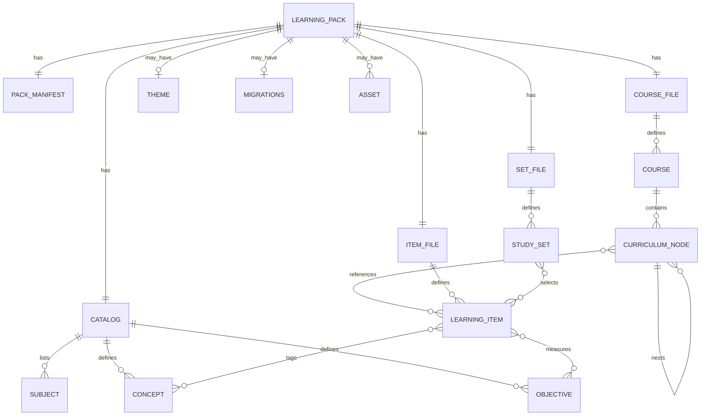
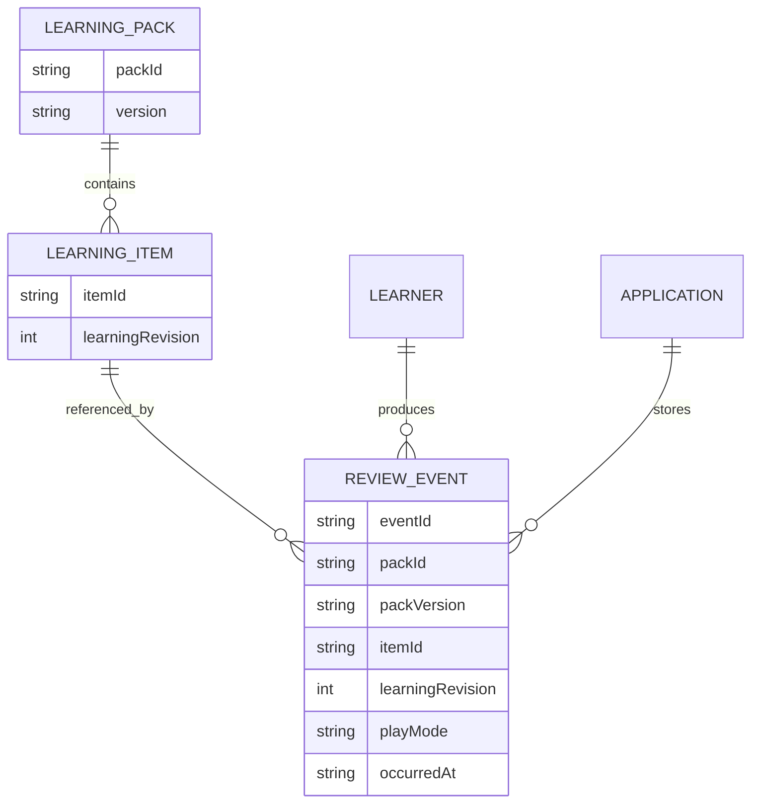

# ADR-001: Learning Pack Contract v0.1

## Status

Accepted.

## Date

2026-06-23

## Context

Learnt and the Flashcards app need one public contract for portable learning
content. The two applications currently have different local models:

- Learnt authors structured `SubjectPackage` data, validates it with
  `defineSubject`, and runs activities through sessions and evidence events.
- The Flashcards app imports Markdown and JSON decks into a local card model
  with progress stored separately under local app state.

The shared contract must be a public interchange format, not a copy of either
application's local database. Authoring, installation, validation, play
projection, and learner progress need explicit boundaries so both apps can
evolve independently.

## Decision

Define Learning Pack Contract v0.1 as a `.learntpack` archive whose canonical
payload is JSON. A `LearningPack` is the downloadable and installable
distribution unit. It contains authored content, catalog metadata, course
organization, study sets, constrained theme hints, optional migration metadata,
and static assets. It never contains learner progress.

Current Flashcard Pack Markdown is a legacy authoring/import adapter. Markdown
can be converted into v0.1 JSON, but it is not the canonical interchange format.

The initial archive extension is:

```text
.learntpack
```

The root archive layout is:

```text
pack.json
catalog.json
courses.json
items.json
sets.json
theme.json
migrations.json
assets/
```

`theme.json`, `migrations.json`, and `assets/` are optional. All other files
are required in a valid released pack.

## Entity Relationships

### Pack Content



### Progress Boundary



`ReviewEvent` is a separate contract. It is not stored in `.learntpack`
archives.

## Ownership Boundaries

| Owner | Owns | Does not own |
| --- | --- | --- |
| Shared learning-pack package | JSON schemas, archive layout, validators, capability negotiation rules, content identity rules, migration metadata semantics, `ReviewEvent` contract | Learnt's session engine, Flashcards local storage, UI rendering, app-specific persistence |
| Learnt | `SubjectPackage` authoring, `defineSubject` validation, session/evidence runtime, Learnt import/export adapters, Learnt progress storage | The canonical public pack schema, Flashcards storage, executable pack extensions |
| Flashcards app | Markdown legacy adapter, current card/deck UI, local quiz/flashcard behavior, local progress storage, Flashcards import/export adapter | The canonical public pack schema, Learnt subject registry, learner progress inside packs |
| Pack authors/tools | Produce JSON packs, assets, and optional migrations that validate against v0.1 | Bypassing validation, embedding executable renderers, embedding learner progress |
| Installing apps | Validate packs, negotiate capabilities, store install state, map theme hints into app UI, store progress separately | Mutating released pack content, treating app database shape as the public contract |

## File Responsibilities And Fields

All JSON files use UTF-8, JSON objects at the top level, camelCase field names,
and `schemaVersion: "0.1"`.

### `pack.json`

`pack.json` is the root manifest for distribution, compatibility, file
integrity, and install identity.

Required fields:

| Field | Type | Description |
| --- | --- | --- |
| `schemaVersion` | string | Must be `"0.1"`. |
| `packId` | string | Stable pack namespace. |
| `version` | string | Immutable release version for this pack. |
| `title` | string | Human-facing pack title. |
| `summary` | string | Short human-facing summary. |
| `language` | string | BCP 47 language tag, for example `"en-US"`. |
| `license` | string | License identifier or pack-specific license label. |
| `authors` | array | Author records with `name` and optional `url`. |
| `releasedAt` | string | ISO 8601 release timestamp. |
| `capabilities` | object | Required and optional capability declarations. |
| `files` | array | Manifest of JSON files and asset files in the archive. |

Optional fields:

| Field | Type | Description |
| --- | --- | --- |
| `homepageUrl` | string | Public information URL. |
| `repositoryUrl` | string | Source repository URL. |
| `supportUrl` | string | Support or issue-reporting URL. |
| `keywords` | string array | Search and catalog terms. |

`capabilities` shape:

```json
{
  "required": [
    { "capabilityId": "core.learning-pack", "version": "0.1" }
  ],
  "optional": [
    { "capabilityId": "theme.metadata", "version": "0.1" }
  ]
}
```

`files` entries:

```json
{
  "assetId": null,
  "path": "items.json",
  "role": "items",
  "mediaType": "application/json",
  "sha256": "64 lowercase hex characters",
  "bytes": 12345
}
```

`files` entry fields:

| Field | Type | Description |
| --- | --- | --- |
| `assetId` | string or null | Required when `role` is `asset`; null otherwise. |
| `path` | string | Relative path inside the archive. |
| `role` | string | File role. |
| `mediaType` | string | IANA media type. |
| `sha256` | string | SHA-256 digest as 64 lowercase hex characters. |
| `bytes` | integer | File byte length. |

Allowed `role` values are `catalog`, `courses`, `items`, `sets`, `theme`,
`migrations`, and `asset`.

### `catalog.json`

`catalog.json` owns searchable content metadata and the knowledge taxonomy.
Concepts and objectives are independent from the curriculum tree.

Required fields:

| Field | Type | Description |
| --- | --- | --- |
| `schemaVersion` | string | Must be `"0.1"`. |
| `subjects` | array | Subject records contained in the pack. |
| `concepts` | array | Knowledge concepts. |
| `objectives` | array | Learning objectives. |

`subjects` entries:

| Field | Type | Description |
| --- | --- | --- |
| `subjectId` | string | Stable local subject ID. |
| `title` | string | Display title. |
| `summary` | string | Short description. |
| `tags` | string array | Search/filter tags. |
| `conceptIds` | string array | Concepts primarily associated with this subject. |
| `objectiveIds` | string array | Objectives primarily associated with this subject. |
| `courseIds` | string array | Courses that teach this subject. |

`concepts` entries:

| Field | Type | Description |
| --- | --- | --- |
| `conceptId` | string | Stable local concept ID. |
| `title` | string | Display title. |
| `summary` | string | Short explanation. |
| `tags` | string array | Search/filter tags. |
| `prerequisiteConceptIds` | string array | Concept IDs that should generally precede this concept. |
| `relatedConceptIds` | string array | Non-prerequisite related concepts. |

`objectives` entries:

| Field | Type | Description |
| --- | --- | --- |
| `objectiveId` | string | Stable local objective ID. |
| `statement` | string | Learner-facing objective statement. |
| `successCriteria` | string array | Observable success criteria. |
| `conceptIds` | string array | Concepts this objective depends on or assesses. |

### `courses.json`

`courses.json` owns course organization. A pack can contain multiple subjects
and multiple courses. Course structure uses recursive `CurriculumNode` values
instead of a fixed module/chapter depth.

Required fields:

| Field | Type | Description |
| --- | --- | --- |
| `schemaVersion` | string | Must be `"0.1"`. |
| `courses` | array | Course records. |

`courses` entries:

| Field | Type | Description |
| --- | --- | --- |
| `courseId` | string | Stable local course ID. |
| `title` | string | Display title. |
| `summary` | string | Short course description. |
| `subjectIds` | string array | Subjects taught by this course. |
| `tags` | string array | Search/filter tags. |
| `rootNodes` | CurriculumNode array | Ordered top-level curriculum nodes. |

`CurriculumNode` fields:

| Field | Type | Description |
| --- | --- | --- |
| `nodeId` | string | Stable local curriculum node ID. |
| `kind` | string | One of `module`, `unit`, `chapter`, `lesson`, `section`, `custom`. |
| `title` | string | Display title. |
| `summary` | string | Short description. |
| `itemIds` | string array | Ordered LearningItem IDs taught or played at this node. |
| `conceptIds` | string array | Concepts emphasized by this node. |
| `objectiveIds` | string array | Objectives emphasized by this node. |
| `children` | CurriculumNode array | Ordered child nodes. |
| `customKindLabel` | string or null | Required when `kind` is `custom`; otherwise null. |

Array order in `rootNodes`, `children`, and `itemIds` is the authored course
order.

### `items.json`

`items.json` owns canonical playable content. `LearningItem` is the canonical
playable content unit.

Required fields:

| Field | Type | Description |
| --- | --- | --- |
| `schemaVersion` | string | Must be `"0.1"`. |
| `items` | array | LearningItem records. |

`LearningItem` fields:

| Field | Type | Description |
| --- | --- | --- |
| `itemId` | string | Stable local item ID. |
| `learningRevision` | integer | Starts at `1`; changes only when previous mastery may no longer be educationally valid. |
| `title` | string | Display title. |
| `promptBlocks` | ContentBlock array | Prompt/front/question content. |
| `response` | ResponseDefinition | Expected response shape. |
| `evaluation` | EvaluationDefinition | Evaluation or self-check definition. |
| `reviewedSolutionBlocks` | ContentBlock array | Reviewed back/solution/explanation content. |
| `conceptIds` | string array | Concepts covered by this item. |
| `objectiveIds` | string array | Objectives assessed or practiced by this item. |
| `allowedPlayModes` | string array | Play modes allowed for this item. |

Allowed `allowedPlayModes` values:

- `flashcard`
- `single-choice-quiz`
- `multiple-choice-quiz`
- `text-recall`
- `number-recall`
- `manual-read`
- `self-grade-review`

`ContentBlock` fields:

| Field | Type | Description |
| --- | --- | --- |
| `kind` | string | One of `text`, `question`, `code`, `equation`, `callout`, `image`, `audio`. |
| `text` | string | Required for `text`, `question`, `code`, `equation`, and `callout`. |
| `language` | string or null | Code language for `code`; otherwise null. |
| `calloutRole` | string or null | One of `note`, `tip`, `warning`, `definition`; required for `callout`. |
| `assetId` | string or null | Asset reference for `image` and `audio`; otherwise null. |
| `altText` | string or null | Required for `image`; optional for `audio`. |

`ResponseDefinition` fields:

| Field | Type | Description |
| --- | --- | --- |
| `kind` | string | One of `none`, `single-choice`, `multiple-choice`, `text`, `number`, `self-grade`. |
| `options` | array | Choice options for `single-choice` and `multiple-choice`; empty otherwise. |
| `textInput` | object or null | Text constraints for `text`; otherwise null. |
| `numberInput` | object or null | Numeric constraints for `number`; otherwise null. |

Choice option fields:

| Field | Type | Description |
| --- | --- | --- |
| `optionId` | string | Stable within the containing item. |
| `label` | string | Plain display label. |
| `contentBlocks` | ContentBlock array | Optional richer option content; empty when unused. |

`textInput` fields:

| Field | Type | Description |
| --- | --- | --- |
| `placeholder` | string or null | Optional input placeholder. |
| `minLength` | integer or null | Minimum character count. |
| `maxLength` | integer or null | Maximum character count. |

`numberInput` fields:

| Field | Type | Description |
| --- | --- | --- |
| `placeholder` | string or null | Optional input placeholder. |
| `unitLabel` | string or null | Optional display unit. |
| `min` | number or null | Optional minimum accepted input. |
| `max` | number or null | Optional maximum accepted input. |

`EvaluationDefinition` fields:

| Field | Type | Description |
| --- | --- | --- |
| `kind` | string | One of `manual-completion`, `choice-selection`, `exact-text`, `numerical-tolerance`, `self-grade`. |
| `correctOptionIds` | string array | Required for `choice-selection`; empty otherwise. |
| `acceptedAnswers` | string array | Required for `exact-text`; empty otherwise. |
| `caseSensitive` | boolean | Applies to `exact-text`. |
| `trimWhitespace` | boolean | Applies to `exact-text`. |
| `expectedNumber` | number or null | Required for `numerical-tolerance`; otherwise null. |
| `absoluteTolerance` | number or null | Required for `numerical-tolerance`; otherwise null. |
| `passingSelfGrades` | string array | Allowed values are `again`, `hard`, `good`, `easy`; applies to `self-grade`. |

Compatibility rules:

- `single-choice` response requires `choice-selection` evaluation with exactly
  one `correctOptionIds` value.
- `multiple-choice` response requires `choice-selection` evaluation with one or
  more `correctOptionIds` values.
- `text` response requires `exact-text` evaluation.
- `number` response requires `numerical-tolerance` evaluation.
- `none` response requires `manual-completion` evaluation.
- `self-grade` response requires `self-grade` evaluation.
- Rubric text, opaque evaluator payloads, and executable graders are not part
  of v0.1.

### `sets.json`

`sets.json` owns reusable decks, quizzes, reviews, practice sets, and exams.
Study sets select LearningItems by explicit references or by selection rules.

Required fields:

| Field | Type | Description |
| --- | --- | --- |
| `schemaVersion` | string | Must be `"0.1"`. |
| `sets` | array | StudySet records. |

`StudySet` fields:

| Field | Type | Description |
| --- | --- | --- |
| `setId` | string | Stable local set ID. |
| `kind` | string | One of `deck`, `quiz`, `review`, `practice`, `exam`. |
| `title` | string | Display title. |
| `summary` | string | Short description. |
| `selection` | object | Explicit or rule-based item selection. |
| `playModes` | string array | Play modes the set may use. |
| `ordering` | string | One of `authored`, `shuffle`, `adaptive`. |
| `timeLimitSeconds` | integer or null | Optional exam/quiz time limit. |
| `attemptLimit` | integer or null | Optional attempt limit. |

Explicit selection:

```json
{
  "kind": "explicit",
  "itemIds": ["predict-negation", "identify-and"]
}
```

Rule selection:

```json
{
  "kind": "rule",
  "include": {
    "subjectIds": ["logic-basics"],
    "courseIds": ["logic-basics-core"],
    "nodeIds": ["boolean-module"],
    "conceptIds": ["boolean-values"],
    "objectiveIds": ["predict-negation"],
    "allowedPlayModes": ["single-choice-quiz"],
    "tags": ["foundations"]
  },
  "exclude": {
    "itemIds": [],
    "conceptIds": [],
    "objectiveIds": [],
    "tags": []
  },
  "limit": 20
}
```

Rule selection is evaluated against pack metadata only, never against learner
progress. Apps may build progress-aware queues locally after selecting the
eligible item pool.

### `theme.json`

`theme.json` is optional and owns constrained presentation hints. It is metadata
only. Packs must not contain CSS, HTML, JavaScript, React components, executable
theme plugins, or layout code.

Required fields when the file exists:

| Field | Type | Description |
| --- | --- | --- |
| `schemaVersion` | string | Must be `"0.1"`. |
| `themeId` | string | Stable local theme ID. |
| `displayName` | string | Human-facing theme name. |
| `accentColor` | string | Hex color in `#RRGGBB` form. |
| `backgroundRole` | string | One of `light`, `dark`, `system`. |
| `iconAssetId` | string or null | Optional icon asset. |
| `coverAssetId` | string or null | Optional cover asset. |

Installing apps may ignore theme metadata with a warning if they do not support
`theme.metadata`.

### `migrations.json`

`migrations.json` is optional and owns declarative update hints between released
versions of the same `packId`. It does not contain learner progress.

Required fields when the file exists:

| Field | Type | Description |
| --- | --- | --- |
| `schemaVersion` | string | Must be `"0.1"`. |
| `migrations` | array | Migration records. |

Migration fields:

| Field | Type | Description |
| --- | --- | --- |
| `fromVersion` | string | Previous immutable pack version. |
| `toVersion` | string | Current immutable pack version. |
| `entityMappings` | array | ID and progress migration hints. |
| `notes` | string | Human-readable migration summary. |

`entityMappings` entries:

| Field | Type | Description |
| --- | --- | --- |
| `entityKind` | string | One of `subject`, `course`, `curriculum-node`, `concept`, `objective`, `item`, `set`. |
| `fromId` | string | Local entity ID in `fromVersion`. |
| `toId` | string or null | Local entity ID in `toVersion`; null when removed. |
| `changeKind` | string | One of `unchanged`, `renamed`, `split`, `merged`, `removed`, `revised`. |
| `fromLearningRevision` | integer or null | Required for item mappings when applicable. |
| `toLearningRevision` | integer or null | Required for item mappings when applicable. |
| `progressPolicy` | string | One of `preserve`, `reset-mastery`, `history-only`, `manual-review`. |
| `rationale` | string | Short reason for the mapping. |

Rules:

- v0.1 migrations only apply within the same `packId`.
- `preserve` is valid for item progress only when `fromLearningRevision` and
  `toLearningRevision` are equal.
- `reset-mastery` keeps historical ReviewEvents but starts current mastery over.
- `history-only` keeps old ReviewEvents for audit/history and does not count
  them toward current mastery.
- `manual-review` tells the app not to automatically migrate derived mastery.

### `assets/`

`assets/` stores static pack assets referenced by JSON. Assets are addressed by
`assetId` records in `pack.json.files` and by `assetId` fields in content or
theme metadata.

Allowed asset media types in v0.1:

- `image/png`
- `image/jpeg`
- `image/webp`
- `image/svg+xml`
- `audio/mpeg`
- `audio/ogg`
- `audio/wav`

Rules:

- Asset paths must be relative paths under `assets/`.
- Paths must not contain absolute paths, drive letters, empty segments, `.`, or
  `..`.
- Asset entries in `pack.json.files` must include `assetId`, `path`,
  `role: "asset"`, `mediaType`, `sha256`, and `bytes`.
- SVG assets must be static: no script, event handlers, external resources,
  embedded HTML, or remote references.
- Assets must not be fetched from the network during validation or play.

## ID Rules

`packId` rules:

- `packId` must match `^[a-z0-9]+([.-][a-z0-9]+)*$`.
- It is a stable namespace, not a display label.
- It should use a publisher or product namespace when available, for example
  `learnt.logic-basics-core`.

Local entity ID rules:

- Local entity IDs must match `^[a-z0-9][a-z0-9._/-]{0,127}$`.
- Local entity IDs must not contain `:`, whitespace, `..`, leading `/`, or
  trailing `/`.
- Local entity IDs must be unique across all identity-bearing entities in the
  pack: subjects, courses, curriculum nodes, concepts, objectives, items, sets,
  themes, and assets.
- Choice `optionId` values are unique only inside their containing
  `LearningItem`.
- IDs must not be generated from array position.
- Display labels must be stored separately from IDs.

Global content identity is:

```text
packId + local entity ID
```

For installed content and progress records, use the tuple form:

```text
(packId, entityId)
```

When version-specific behavior matters, include `packVersion` and, for items,
`learningRevision`.

## Versioning Rules

- `schemaVersion` identifies the file contract and is `"0.1"` for every v0.1
  JSON file.
- `pack.json.version` identifies an immutable pack release.
- Released `(packId, version)` pairs are immutable.
- Re-publishing the same `(packId, version)` with different bytes is invalid.
- Installing the same `(packId, version)` with identical file hashes is
  idempotent.
- Entity IDs remain stable while the educational identity remains the same.
- `learningRevision` starts at `1`.
- `learningRevision` changes only when previous mastery may no longer be
  educationally valid.

`learningRevision` must change when:

- The correct answer changes.
- The prompt meaning changes.
- The evaluation semantics change.
- The reviewed solution corrects a substantive mistake.
- The item's concept/objective target changes in a way that changes what
  mastery means.

`learningRevision` does not change for:

- Typo fixes that do not change meaning.
- Title or summary edits that do not affect the prompt, response, evaluation,
  or solution.
- Theme changes.
- Asset compression changes that do not affect educational content.
- Course reordering that does not change the item itself.

## Update Behavior

Installers must treat a pack update as installation of a new immutable
`(packId, version)` pair.

Required behavior:

1. Validate the new archive fully before changing installed state.
2. Reject an archive when the same `(packId, version)` is already installed with
   different file hashes.
3. Install identical `(packId, version)` bytes idempotently.
4. Preserve enough old manifest metadata to interpret existing ReviewEvents.
5. Use `migrations.json` when deriving current progress for a newer version.
6. Keep old ReviewEvents as historical records unless the user explicitly
   deletes local progress.
7. Mark removed items unavailable for new play, but keep their historical
   ReviewEvents readable.

Apps may show only the latest installed version in the normal catalog, but they
must not rewrite old ReviewEvents to pretend they occurred against a different
pack version.

## Progress And ReviewEvent Contract

Learner progress is never embedded in a public pack. `ReviewEvent` is private
learner data and remains outside `.learntpack` archives. Apps store events
locally or in their own sync service, then derive mastery and scheduling state
from those events.

The shared contract transports learning evidence only. It does not define a
shared spaced-repetition scheduler, mastery model, due-date calculation,
retention algorithm, or card-statistics aggregate. Learnt and Flashcards may
derive their own mastery and scheduling state from the same event stream.

`ReviewEvent` v0.1 top-level fields:

| Field | Type | Description |
| --- | --- | --- |
| `schemaVersion` | string | Must be `"0.1"`. |
| `eventId` | string | Stable source-local event ID. Unique within `sourceInstanceId`. |
| `packId` | string | Pack namespace. |
| `packVersion` | string | Pack version installed when reviewed. |
| `itemId` | string | LearningItem reviewed. |
| `learningRevision` | integer | Item revision reviewed. |
| `subjectId` | string or null | Subject context when the app can determine it; otherwise null. |
| `courseId` | string or null | Course context when the app can determine it; otherwise null. |
| `playMode` | string | Play mode used. |
| `responseSummary` | object | Bounded summary of the learner response. |
| `result` | string | One of `correct`, `incorrect`, `completed`, `self-graded`, `ungraded`. |
| `normalizedScore` | number or null | Score from `0` to `1` when available; null when not meaningful. |
| `responseTimeMs` | integer or null | Non-negative response time when available. |
| `occurredAt` | string | ISO 8601 timestamp for when the learner action occurred. |
| `sourceInstanceId` | string | Stable device, app install, sync source, or import-source instance ID. |
| `confusionTargetIds` | string[] | Optional local entity IDs the learner confused this item with. Empty when absent. |
| `privacy` | object or null | Optional privacy-sensitive metadata, described below. |
| `extensions` | object or null | Namespaced forward-compatible app/vendor metadata. |

`ReviewEvent.responseSummary` fields:

| Field | Type | Description |
| --- | --- | --- |
| `kind` | string | One of `none`, `choice`, `text`, `number`, `self-grade`, `custom`. |
| `selectedOptionIds` | string[] | Selected choice option IDs for choice responses; empty otherwise. |
| `enteredText` | string or null | Text-response summary when retained. May be null if redacted. |
| `enteredNumber` | number or null | Numeric-response summary when retained. May be null if redacted. |
| `selfGrade` | string or null | One of `again`, `hard`, `good`, `easy` for self-grade play. |
| `customSummary` | object or null | App-owned summary for `kind: "custom"` only. |

`ReviewEvent.privacy` fields:

| Field | Type | Description |
| --- | --- | --- |
| `learnerId` | string or null | App-owned learner identifier; null for anonymous/local use. |
| `sessionId` | string or null | App-owned session ID. |
| `sourceAppId` | string or null | App that recorded the event. |
| `sourceAppVersion` | string or null | App version that recorded the event. |

Privacy rules:

- `ReviewEvent` data is private learner data, not pack content.
- Public packs must never contain ReviewEvents, derived mastery, due dates, or
  app-local card statistics.
- `sourceInstanceId`, `privacy`, and text response summaries may identify a
  learner or device. Sync/export features may set `privacy` to null and may
  redact `enteredText` or `enteredNumber` when the user or product policy
  requires minimization.
- ReviewEvents must not expose private answer keys. They may record learner
  response summaries, results, and scores only.
- Apps should encrypt, access-control, or otherwise protect ReviewEvents
  according to their own learner-data policy.

Event identity and deduplication:

- The canonical event identity is `(sourceInstanceId, eventId)`.
- `eventId` must be stable for the original learner action. Retrying an import
  or sync must reuse the same identity, not mint a new event.
- A duplicate with the same identity and identical canonical JSON payload is
  ignored.
- A duplicate with the same identity and different payload is an import
  conflict. The importer must not silently merge or overwrite. It should keep
  the existing event and quarantine, reject, or app-locally version the
  conflicting incoming event.

Ordering:

- Primary chronological ordering is `occurredAt` ascending.
- Deterministic tie-breakers are `sourceInstanceId` then `eventId`.
- Import order is not semantically meaningful.
- Events with equal timestamps are concurrent for mastery derivation unless an
  app adds private session metadata in `extensions`.

Import conflict behavior:

- Events that reference an installed pack/item/revision can be applied to the
  app's derived progress views.
- Events that reference missing content may be imported as unresolved
  historical evidence, but must not affect current mastery until the referenced
  pack content is available and validated.
- Importers must not rewrite `packVersion`, `itemId`, or `learningRevision` to
  fit currently installed content. Migration metadata may guide derived state,
  but old ReviewEvents remain historical records.

Validation:

- Structural validation uses `reviewEventSchema`.
- Semantic validation checks local ID syntax, response-summary consistency,
  normalized score range, non-negative response time, and date-time formatting.
- When validating against a known pack, validators also check `packId`,
  `packVersion`, `itemId`, `learningRevision`, allowed `playMode`,
  selected-option IDs, subject/course IDs, and confusion target IDs.
- A `choice` summary must include at least one selected option ID.
- Non-choice summaries must not include selected option IDs. Text and number
  summaries may redact entered values by setting them to null.
- Unknown top-level fields are invalid in v0.1. Forward-compatible app/vendor
  metadata must be placed under `extensions`.

Forward compatibility:

- `extensions` is optional-by-null and may contain namespaced keys such as
  `com.example.analytics`.
- Consumers may ignore unknown extension keys with warnings.
- Extensions must not change the meaning of required fields, add executable
  behavior, define a shared scheduler, or be required to interpret core
  evidence.

## Progress Migration Behavior

When a newer pack version is installed, current mastery is derived as follows:

1. Partition existing ReviewEvents by `(packId, itemId, learningRevision)`.
2. Load `migrations.json` from the new pack version when present.
3. For unchanged item IDs with unchanged `learningRevision`, carry derived
   mastery forward.
4. For renamed item IDs with unchanged `learningRevision` and
   `progressPolicy: "preserve"`, carry derived mastery to the new item ID.
5. For any item where `learningRevision` changes, keep old ReviewEvents as
   history but reset current mastery unless the app deliberately asks the
   learner to re-confirm.
6. For split, merged, removed, or revised mappings, follow `progressPolicy`.
7. If no migration entry exists, preserve only exact item ID plus exact
   `learningRevision` matches.
8. Never edit old ReviewEvents in place; write new app-owned migration markers
   or rebuild derived progress views.

## Capability Negotiation

Capabilities are declared in `pack.json.capabilities`.

Rules:

- Unknown optional capabilities may be ignored with installation warnings.
- Unknown required capabilities must cause installation failure.
- Optional capabilities must not change the meaning of required fields.
- Data that requires an optional capability must be safe to ignore when the
  capability is unsupported.
- `theme.metadata` is optional in v0.1.
- Executable renderers, executable evaluators, CSS themes, HTML themes,
  JavaScript plugins, and React plugins are not valid capabilities in v0.1.

Initial capability IDs:

| Capability | Required | Description |
| --- | --- | --- |
| `core.learning-pack` | yes | The v0.1 archive, manifest, catalog, course, item, set, and validation rules. |
| `theme.metadata` | no | Constrained `theme.json` hints. |
| `migrations.basic` | no | Declarative same-pack migration metadata. |
| `assets.static` | no | Static assets referenced from content or theme metadata. |

## Validation Stages

Installers and validators must process packs in these stages:

1. Archive validation: require `.learntpack`, enforce size limits, reject path
   traversal, reject duplicate paths, and extract only relative paths.
2. Manifest validation: parse `pack.json`, validate `schemaVersion`, `packId`,
   `version`, `capabilities`, `files`, and required file presence.
3. File integrity validation: verify every declared file path, byte count, media
   type, and SHA-256 digest.
4. JSON schema validation: validate `catalog.json`, `courses.json`,
   `items.json`, `sets.json`, and optional JSON files.
5. ID validation: enforce ID syntax and pack-wide uniqueness for local entity
   IDs.
6. Reference validation: verify all subject, course, node, concept, objective,
   item, set, theme, and asset references.
7. Learning item validation: verify response/evaluation compatibility,
   reviewed solution requirements, and allowed play modes.
8. Capability validation: fail on unknown required capabilities and warn on
   ignored optional capabilities.
9. Security validation: reject executable content, unsafe SVG, remote asset
   references, absolute paths, and unsupported media types.
10. Install transaction: reject immutable version conflicts, then update the
   app's installed-pack registry atomically.

Validators should return structured diagnostics with `code`, `severity`,
`path`, and `message`.

## Security Boundaries

- Treat every pack as untrusted input until all validation stages pass.
- Never execute code from a pack.
- Never evaluate CSS, HTML, JavaScript, React components, WebAssembly, native
  plugins, shell commands, or remote scripts from a pack.
- Do not allow pack assets to trigger network requests during validation or
  play.
- Sanitize SVG or reject it when the host app cannot sanitize safely.
- Render text as text. If an app supports Markdown authoring, convert it to the
  safe `ContentBlock` subset before publishing JSON.
- Keep learner progress, learner identity, and app-private settings outside the
  pack.
- Map `theme.json` only into app-owned allowlisted visual tokens.
- Extension-like future data must be declared by capabilities and must remain
  JSON data, not executable behavior.

## Application Mapping: Flashcards App

| Contract term | Current Flashcards source | v0.1 mapping |
| --- | --- | --- |
| `LearningPack.packId` | Not persisted today; Markdown `Pack` is only display metadata | Adapter must create or read a stable `packId`; imported metadata must be stored in a pack registry. |
| `LearningPack.version` | Markdown `Version` when present; otherwise parser reports `1` | Map to `pack.json.version`; default only during legacy conversion, not canonical publishing. |
| `Subject` | `topic`, default concept, pack metadata | Create subject records from pack/topic metadata during legacy conversion. |
| `Course` | Whole local deck or imported pack | Create a default course per converted legacy pack. |
| `CurriculumNode` | Topic groups and local queues | Create recursive nodes from topics when converting legacy cards; do not infer a fixed module/chapter depth. |
| `Concept` | `card.topic`; dormant `related` links | Convert topics to concepts; convert `related` only when it references known concepts/items. |
| `Objective` | No explicit current field | Legacy adapter may create broad default objectives or require author-supplied objectives for canonical packs. |
| `LearningItem.itemId` | Current normalized `card.id` | Preserve as `itemId` when possible; make progress keys pack-aware before importing overlapping packs. |
| `LearningItem.promptBlocks` | `card.term` | Convert to a `question` or `text` block depending on play mode. |
| `LearningItem.reviewedSolutionBlocks` | `card.def`; optional `short` | Convert definition to reviewed solution/back content. |
| `LearningItem.conceptIds` | `card.topic` | Map topic slug to concept ID. |
| `StudySet` | Full deck, flash queue, quiz queue, focus queue | Persist reusable sets from explicit item references or rules; progress-aware queues stay app-local. |
| `ThemeMetadata` | App-owned `dark`, `pastel`, `mono`, CSS variables, user preference | Do not export app CSS or user theme. Optionally map pack accent/icon hints into app-owned themes. |
| `ReviewEvent` | Aggregate `progress[cardId]`, `recordAnswer(cardId, ok)`, session `history` | Future app should append ReviewEvents. Existing aggregates can be migrated only as approximate app-local history, not public pack data. |

## Application Mapping: Learnt

| Contract term | Current Learnt source | v0.1 mapping |
| --- | --- | --- |
| `LearningPack` | None today | Wrap validated subject content plus manifest, courses, items, sets, theme metadata, migrations, and assets. |
| `pack.json.packId` | `SubjectPackage.id` or publisher-chosen namespace | Exporter must choose a stable pack namespace separate from Learnt's local registry internals. |
| `pack.json.version` | `SubjectPackage.version` | Can map directly for single-subject packs; multi-subject packs need a pack-level version. |
| `Subject` | `SubjectPackage` | Map `id`, `title`, `summary`, `tags`, concept IDs, objective IDs, and course IDs. |
| `Course` | `SubjectPackage` plus ordered `modules` | A Learnt subject can export as one course; multi-subject packs may include multiple courses. |
| `CurriculumNode` | `ModuleDefinition`, activity sequence, `nextActivityIds` | Modules become `module` nodes; nested structures may be authored later without changing the contract. |
| `Concept` | `ConceptDefinition` | Map `id`, `title`, `summary`, `tags`, prerequisites, and related concepts. |
| `Objective` | `LearningObjective` | Map `id`, `statement`, `successCriteria`, and concept references. |
| `LearningItem` | `ActivityDefinition` | Map `id` to `itemId`, activity blocks to `promptBlocks`, response/evaluation definitions to v0.1 compatible definitions, deterministic solutions to `reviewedSolutionBlocks`, and references to concept/objective IDs. |
| `StudySet` | Derived activity groups | Export explicit or rule-based sets from modules, activity kinds, concepts, objectives, or authored study definitions. |
| `ThemeMetadata` | No subject theme; app CSS and presentation policy are runtime-owned | Export no theme by default or only constrained metadata supplied outside Learnt's CSS/presentation policy. |
| `ReviewEvent` | `EvidenceEvent` plus `LearningSessionRecord` context | Export app-owned review events with pack/item identity, response summary, result, score, timestamp, source instance, optional context IDs, and privacy metadata; do not embed them in packs. |

Unsupported Learnt projections in v0.1:

- `rubric-assisted-text` as an answer-bearing flashcard or quiz item without an
  explicit reviewed solution.
- `extension` content or evaluation payloads unless a future shared capability
  defines and validates them.
- `code` responses without a deterministic reviewed solution and evaluator.
- `confidence` responses as answer-bearing content.

## Consequences

- Both apps can share installed content identity without sharing a local
  database format.
- Apps can project the same LearningItems into flashcards, quizzes, reviews,
  manual reading, and exams.
- Learner progress can survive pack updates when item identity and
  `learningRevision` allow it.
- Pack validation becomes a required shared package responsibility before either
  app installs content.
- Legacy Markdown remains useful as an authoring/import path, but JSON is the
  canonical contract.

## Explicit Non-Goals For v0.1

- Implementing the shared package, app adapters, installer, or validators.
- Copying Learnt's `SubjectPackage` as the public pack schema.
- Copying the Flashcards app's local card or localStorage schema as the public
  pack schema.
- Embedding learner progress, streaks, history, local preferences, or learner
  identity in public packs.
- Defining a remote marketplace, payment system, entitlement system, or sync
  service.
- Supporting executable plugins, executable evaluators, arbitrary renderers,
  CSS themes, HTML themes, JavaScript, React components, WebAssembly, or native
  code.
- Guaranteeing that every app supports every allowed play mode.
- Auto-generating learning content with an LLM.
- Treating rubric criteria as reviewed flashcard backs.
- Supporting cross-pack migrations or cross-pack entity references.
- Supporting SCORM, xAPI, QTI, or another external learning standard as the
  v0.1 canonical format.
- Defining collaborative authoring workflows, review queues, or publishing
  approvals.
- Defining remote media streaming or network asset loading.
