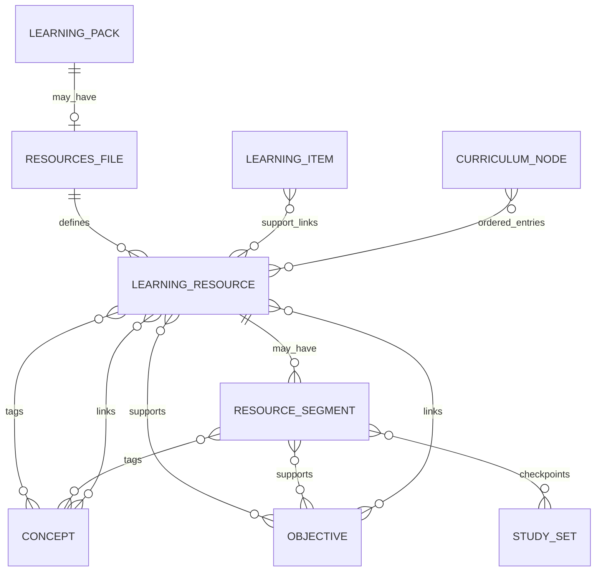
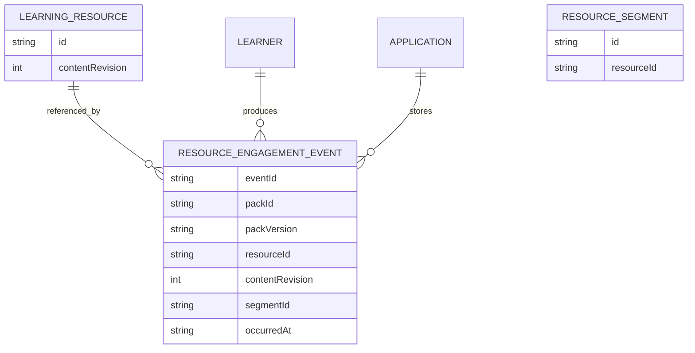

# ADR-002: Learning Resource Teaching Layer

## Status

Accepted.

## Date

2026-06-23

## Context

ADR-001 defines the v0.1 Learning Pack contract around installable pack
content, playable `LearningItem` records, reusable `StudySet` records, and
private `ReviewEvent` evidence. That is enough for practice-only packs, but it
does not provide a portable way to ship teaching material such as readings,
video references, audio references, textbook references, worked examples, or
interactive links that prepare learners before practice.

Learnt and Flashcards need this teaching layer without turning public packs
into app-specific page layouts, executable plugins, CSS bundles, HTML pages, or
web apps. The extension must remain framework-independent, validate with the
same package, and preserve compatibility for existing practice-only packs.

## Decision

Add first-class `LearningResource` records to v0.1 as an optional teaching
layer. Packs may include `resources.json`; practice-only packs without
`resources.json` remain valid.

`LearningResource` is the canonical portable teaching unit. It is data, not an
executable renderer. A resource may be pack-authored embedded content, an
external URL, a video locator, an audio locator, a bibliographic reference, or
an interactive-reference locator. Resource engagement evidence is private
learner data and remains outside `.learntpack` archives as
`ResourceEngagementEvent`.

## Entity Relationships





## File Layout

The v0.1 archive layout is extended with one optional file:

```text
pack.json
catalog.json
courses.json
items.json
sets.json
resources.json
theme.json
migrations.json
assets/
```

`resources.json` is optional. When present, `pack.json.files` must declare it
with `role: "resources"`, `mediaType: "application/json"`, byte count, and
SHA-256 hash. Existing packs without this file continue to validate.

## `resources.json`

Top-level fields:

| Field | Type | Description |
| --- | --- | --- |
| `schemaVersion` | string | Must be `"0.1"`. |
| `resources` | array | `LearningResource` records. |

`LearningResource` fields:

| Field | Type | Description |
| --- | --- | --- |
| `id` | string | Stable local resource ID. |
| `contentRevision` | integer | Starts at `1`; changes when previous engagement/completion may no longer be educationally valid. |
| `title` | string | Human-facing resource title. |
| `summary` | string | Optional short summary. |
| `modality` | string | One of `text`, `video`, `audio`, `interactive`, `mixed`. |
| `roles` | string[] | One or more teaching roles. |
| `conceptIds` | string[] | Optional concepts taught or reinforced by the resource. |
| `objectiveIds` | string[] | Optional objectives taught or reinforced by the resource. |
| `estimatedDurationSeconds` | integer | Optional estimated learner time. |
| `difficulty` | string | Optional `introductory`, `foundational`, `intermediate`, or `advanced`. |
| `language` | string | Optional BCP 47 resource language. |
| `source` | object | Discriminated resource source union. |
| `segments` | array | Optional segment records scoped to this resource. |
| `checkpointStudySetIds` | string[] | Optional StudySets to offer after the whole resource. |
| `tags` | string[] | Optional search/filter tags. |
| `provenance` | object | Optional authorship, license, attribution, and review metadata. |
| `accessibility` | object | Optional accessibility metadata. |
| `metadata` | object | Optional non-executable namespaced or authoring metadata. |

Allowed `roles` values:

- `introduction`
- `explanation`
- `demonstration`
- `worked-example`
- `remediation`
- `reference`
- `enrichment`
- `summary`

## Resource Source Union

`source.kind` selects the resource source shape:

| Kind | Responsibility |
| --- | --- |
| `embedded-content` | Pack-authored safe `ContentBlock` content carried inside `resources.json`. |
| `external-link` | HTTPS locator for a text/article/page resource controlled outside the pack. |
| `external-video` | Provider and media locator for video. Optional canonical URL and start/end seconds. |
| `external-audio` | Provider and media locator for audio. Canonical URL is required. Optional start/end seconds. |
| `bibliographic-reference` | Citation data for a book, chapter, article, DOI, ISBN, or page range. |
| `interactive-reference` | HTTPS locator plus summary for an external interactive resource. |

All external URLs must be HTTPS. Packs do not grant permission to execute or
embed remote content. Applications decide whether to open external resources,
and should make that transition explicit to the learner.

## Segments And Checkpoints

`ResourceSegment` fields:

| Field | Type | Description |
| --- | --- | --- |
| `id` | string | Stable segment ID scoped to the containing resource. |
| `title` | string | Segment title. |
| `summary` | string | Optional segment summary. |
| `startSeconds` | number | Optional media start time. |
| `endSeconds` | number | Optional media end time. Must be greater than `startSeconds` when both exist. |
| `contentBlockStartId` | string | Optional first embedded content block ID. |
| `contentBlockEndId` | string | Optional last embedded content block ID. |
| `conceptIds` | string[] | Concepts taught by this segment. |
| `objectiveIds` | string[] | Objectives supported by this segment. |
| `checkpointStudySetIds` | string[] | StudySets to offer after this segment. |
| `tags` | string[] | Segment search/filter tags. |

Segment IDs are unique only within a resource. Global segment identity is:

```text
packId + resourceId + segmentId
```

Helpers and fixtures represent segment entity keys as `resourceId/segmentId`
inside the pack namespace.

## Resource Links

`ResourceLink` lets concepts, objectives, and items point to teaching material:

| Field | Type | Description |
| --- | --- | --- |
| `resourceId` | string | Target resource ID. |
| `segmentId` | string | Optional target segment ID within the resource. |
| `role` | string | Relationship role. |
| `recommendedUse` | string | Optional learner workflow hint. |
| `priority` | integer | Optional lower-number-first display hint. |

Allowed link roles:

- `primary`
- `prerequisite`
- `explanation`
- `alternative-explanation`
- `demonstration`
- `worked-example`
- `remediation`
- `reference`
- `extension`

Allowed recommended uses:

- `before-attempt`
- `after-attempt`
- `after-incorrect`
- `after-repeated-incorrect`
- `during-review`
- `optional`

Resource links are optional on `Concept`, `Objective`, and
`LearningItem.supportResourceLinks`.

## Ordered Curriculum Entries

`CurriculumNode.entries` is an optional ordered union for mixed teaching and
practice flow:

```ts
type CurriculumEntry =
  | { kind: "child-node"; nodeId: string }
  | { kind: "resource"; resourceId: string; segmentId?: string }
  | { kind: "item"; itemId: string }
  | { kind: "study-set"; studySetId: string };
```

`children` and `itemIds` remain valid for existing course projections.
`entries` adds a more explicit authored order when resources, individual
items, child nodes, and StudySets need to appear in one sequence. Duplicate
identical entries inside one node are invalid. Missing entry targets are
invalid. Child-node entries must reference direct child nodes of the same
curriculum node.

## Provenance, Accessibility, And Difficulty

Resource provenance is constrained metadata:

| Field | Description |
| --- | --- |
| `author`, `publisher`, `sourceTitle` | Human-readable source metadata. |
| `license`, `licenseUrl`, `attributionText` | License and attribution data. |
| `canonicalUrl` | HTTPS canonical source URL when known. |
| `lastReviewedAt`, `reviewedBy` | Optional curation review metadata. |
| `contentOwnership` | One of `pack-authored`, `licensed-for-redistribution`, `public-domain`, `external-link-only`, `unknown`. |

Validators warn on contradictory provenance, such as embedded pack content
marked `external-link-only`, external locators marked `pack-authored`, or a
license that appears to require attribution without attribution text.

Accessibility metadata is descriptive only. It includes fields such as
`captionsAvailable`, `transcriptAvailable`, `audioDescriptionAvailable`,
`screenReaderOptimized`, `textAlternativeAvailable`, `language`, and
`accessibilityNotes`. Applications may use it for filtering and display.

## Capability Negotiation

Resource support is declared through optional capabilities:

| Capability | Description |
| --- | --- |
| `learning-resource.embedded-content@1` | App can read embedded resource content. |
| `learning-resource.external-link@1` | App can handle external link locators. |
| `learning-resource.external-video@1` | App can handle external video locators. |
| `learning-resource.external-audio@1` | App can handle external audio locators. |
| `learning-resource.bibliographic-reference@1` | App can display bibliographic references. |
| `learning-resource.interactive-reference@1` | App can display/open interactive references. |
| `learning-resource.segments@1` | App can understand resource segments. |
| `learning-resource.checkpoints@1` | App can understand resource checkpoint StudySets. |
| `curriculum.ordered-resource-entries@1` | App can use ordered mixed curriculum entries. |

Unknown optional capabilities may be ignored with warnings. Unknown required
capabilities must block installation. Resource data that depends on an
optional capability must be safe to ignore without changing the meaning of
core playable items.

## Versioning And Migrations

`contentRevision` is the resource equivalent of `learningRevision`.

Increment `contentRevision` when:

- The resource teaching meaning changes.
- A corrected explanation makes prior completion potentially stale.
- The segment boundaries change in a way that affects completion.
- A resource is replaced by materially different content under the same ID.

Do not increment `contentRevision` for typo fixes, title-only edits, optional
tag changes, or provenance corrections that do not affect learner
understanding.

`migrations.json` may map resource changes with:

- `entityKind: "resource"` or `entityKind: "resource-segment"`
- `fromContentRevision`
- `toContentRevision`
- `fromSegmentId`
- `toSegmentId`
- `engagementPolicy`

Allowed `engagementPolicy` values are `preserve`,
`preserve-history-reset-completion`, `archive`, and `do-not-transfer`.
Migration mappings are hints for app-derived resource completion state. They
must not rewrite historical engagement events.

## ResourceEngagementEvent

Resource engagement is private learner evidence and remains outside pack
archives.

Fields:

| Field | Type | Description |
| --- | --- | --- |
| `schemaVersion` | string | Must be `"0.1"`. |
| `eventType` | string | Must be `"resource-engagement"`. |
| `eventId` | string | Stable source-local event ID. |
| `packId` | string | Pack namespace. |
| `packVersion` | string | Pack version installed when engagement occurred. |
| `resourceId` | string | Resource engaged. |
| `contentRevision` | integer | Resource content revision engaged. |
| `segmentId` | string or null | Segment engaged, or null for whole resource. |
| `action` | string | One of `opened`, `started`, `progressed`, `completed`, `revisited`, `abandoned`, `marked-complete`. |
| `progressRatio` | number or null | Optional `0` to `1` progress ratio. |
| `positionSeconds` | number or null | Optional media/read position. |
| `measurement` | string | One of `self-reported`, `player-observed`, `reader-observed`, `external-return`, `unknown`. |
| `occurredAt` | string | ISO 8601 timestamp. |
| `sourceInstanceId` | string | Device/app/source instance ID. |
| `metadata` | object or null | Optional app-owned non-executable metadata. |

Event identity and deduplication use `(sourceInstanceId, eventId)`, matching
`ReviewEvent`. Ordering is `occurredAt`, then `sourceInstanceId`, then
`eventId`. Conflicting duplicates must not be silently merged.

The shared contract transports evidence only. It does not define shared
reading completion rules, video analytics, mastery, or scheduling.

## Validation

Resource validation extends the v0.1 stages:

1. Parse optional `resources.json` when present.
2. Validate schema and file `schemaVersion`.
3. Enforce pack-wide uniqueness for resource IDs and scoped uniqueness for
   segment IDs.
4. Validate source variants and HTTPS URLs.
5. Validate resource concept, objective, StudySet, asset, and segment
   references.
6. Validate ordered curriculum entries and child-node parentage.
7. Detect curriculum cycles and concept prerequisite cycles as before.
8. Validate migration mappings for resource IDs, segment IDs, content
   revisions, and engagement policies.
9. Warn on contradictory provenance.
10. Reject resource engagement events that reference missing pack/resource,
    content revision, or segment IDs when a pack is supplied.

## Security Boundaries

- Never execute pack content.
- `resources.json` is JSON data, not HTML, CSS, JavaScript, React, WebAssembly,
  native code, or plugin code.
- Embedded content uses the existing safe `ContentBlock` subset.
- External resources are locators; validators do not fetch them.
- Applications should open external links explicitly and should not grant
  external content access to learner data.
- Unsupported executable extensions, CSS, HTML, JavaScript, native binaries,
  and executable plugin formats remain unsupported in archives.
- Resource metadata and engagement metadata are untrusted data.

## Golden Fixture And Tests

`fixtures/logic-foundations/` exercises this teaching layer in releases
`1.1.0` and `2.0.0`. It includes all source variants, resource links,
segments, checkpoints, ordered curriculum entries, provenance, accessibility,
resource migration metadata, and a `contentRevision` increase. The TypeScript
unit tests cover structural and semantic validation for resources, resource
engagement events, update helpers, and SDK archive/diff behavior.

## Consequences

- Practice-only packs remain valid.
- Teaching resources can be shared without copying either application's local
  database or renderer model.
- Apps can show teaching material before, during, or after practice using
  portable references.
- Resource completion is app-derived from private events, not embedded in
  public packs.
- External media and interactive resources remain references, not executable
  pack content.

## Explicit Non-Goals For v0.1

- No shared resource player or reader UI.
- No CSS, HTML, JavaScript, React, WebAssembly, native code, or executable
  plugin model.
- No archive-embedded learner progress or resource completion state.
- No shared video analytics, reading analytics, mastery model, or scheduler.
- No remote fetching during validation.
- No cryptographic signing.
- No DRM, entitlement, marketplace, payment, or publisher verification system.
- No cross-pack resource references or cross-pack migrations.
